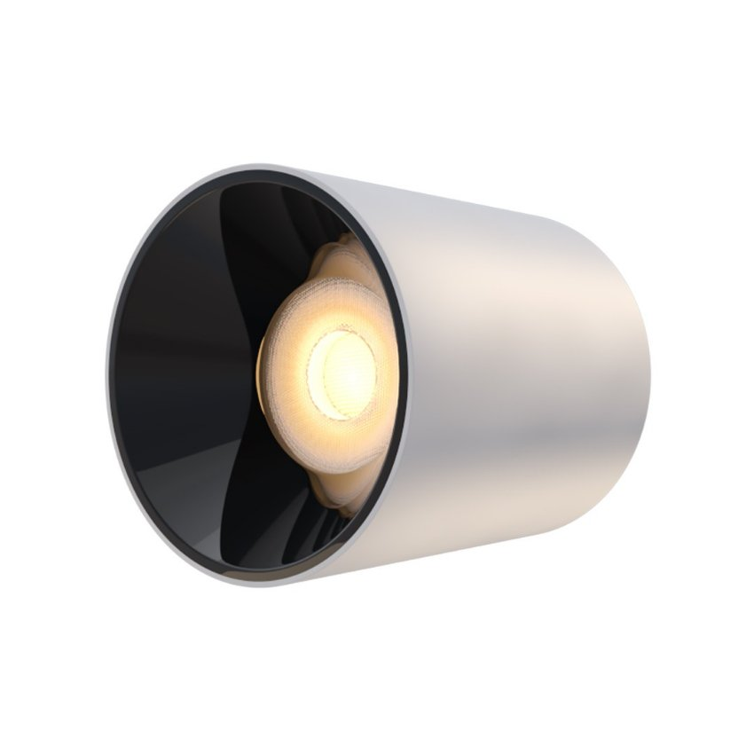

*Những chiếc đèn spotlight trụ 10W ốp nổi 36 độ hiện đại không chỉ cung cấp ánh sáng mà còn được coi như những phụ kiện trang trí độc nhất vô nhị cho không gian sống. Với spotlight trụ nổi gắn trần, khu vực trần nhà của bạn giờ đây cũng có thể mang một diện mạo hoàn toàn khác biệt.*
## **1. Đặc điểm của đèn spotlight trụ 10W ốp nổi 36 độ**
- Đèn đèn spotlight trụ 10W ốp nổi 36 độ (hay còn gọi là đèn ống bơ, đèn ốp nổi, spotlight gắn nổi) hình trụ có tạo hình khối tròn tinh tế, đơn giản.
- Với cùng góc chiếu 36 độ nhưng dòng [***đèn thông minh***](https://lumi.vn/den-led-thong-minh) này được bổ sung chức năng trang trí, khéo léo “khoe” thiết kế đèn và giúp trần nhà nổi bật hơn, so với dòng đèn âm trần.
- Spotlight gắn nổi có nhiều hình dáng và chủng loại, nhưng dòng spotlight hình trụ luôn đứng đầu danh sách những sự lựa chọn vì lý do riêng.

*Đèn spotlight trụ 10W ốp nổi 36 độ*

\>> Xem thêm sản phẩm đèn độc đáo tại Lumi: [***Đèn spotlight vuông 10w ốp nổi 36 độ***](https://lumi.vn/san-pham/den-spotlight-vuong-10w-op-noi-36-do.html)
## **2. Ưu điểm của đèn spotlight hình trụ 10W ốp nổi 36 độ**
- **Thân thiện với môi trường:** đèn LED không chứa thủy ngân và tỏa ra ít nhiệt hơn các dòng đèn huỳnh quang, sợi đốt, vì thế hạn chế được nhiều tác động tiêu cực đối với môi trường xung quanh
- **Độ bền, tuổi thọ cao:** chất liệu nhôm đúc bền bỉ, tuổi thọ trên 25000 giờ
- **Tính thẩm mỹ cao:** màu sắc đen, trắng trên thân đèn khi được lắp đặt trên trần nhà trở thành điểm nhấn thu hút mọi ánh nhìn
- **Thiết kế tinh tế:** khối trụ tròn giúp cân bằng lại những đường thẳng, cứng cáp trên trần nhà, tạo cảm giác mềm mại nhưng không kém phần trẻ trung, năng động cho tổng hòa không gian
- **Dễ dàng nâng cấp** thành đèn spotlight thông minh khi lắp đặt cùng driver Lumi, kết nối đèn với hệ thống smarthome, cho phép bật/tắt cụm đèn trên smartphone và theo ngữ cảnh.
- **Tái hiện màu sắc trung thực:** với chỉ số hoàn màu (CRI) cao 97, đèn cung cấp ánh sáng chất lượng và tái hiện màu sắc của vật thể một cách chân thực nhất
- **An toàn cho thị giác:** đèn LED không phát ra tia cực tím hay tia hồng ngoại nên không gây hại cho mắt
- **Góc chiếu tập trung:** góc chiếu 36 độ giúp thu hẹp khu vực được chiếu sáng, tạo ra sự khác biệt về thị giác trong không gian rộng
## **3. Ứng dụng của đèn spotlight trụ 10W ốp nổi 36 độ**
- Với góc chiếu 36 độ, đèn có thể tạo ra thêm một lớp ánh sáng nổi bật cho căn phòng. Nhờ vậy, đèn spotlight nổi gắn trần được lắp đặt nhiều tại không gian trong nhà với dụng ý chiếu sáng cường độ cao cho một khu vực nhỏ.
- Cách bài trí đèn spotlight trụ gắn nổi theo dụng ý rõ ràng cũng sẽ là ấn tượng độc đáo dành cho những vị khách đến chơi nhà.

*Ứng dụng đèn spotlight trụ 10W ốp nổi 36 độ*

- Thiết kế đơn giản giúp cho dòng đèn này được ưa chuộng đặc biệt bởi những người dùng yêu thích phong cách hiện đại.
- Ngoài các công trình nhà ở, các khách sạn, nhà hàng, quầy giao dịch, trung tâm thương mại, siêu thị cũng có thể lắp loại đèn này để tạo nguồn ánh sáng mạnh, phục vụ các tác vụ đặc thù.
- Không gian mua sắm, nghỉ dưỡng chỉ cần bổ sung các cụm đèn spotlight trụ gắn nổi đã có thể mang đến cảm nhận về nội thất hoàn toàn khác biệt.

Lựa chọn đèn spotlight gắn trần phù hợp với thiết kế và phong cách nội thất đóng vai trò quan trọng giúp bạn tối ưu được ánh sáng và điểm nổi bật của dòng đèn spotlight trụ 10W ốp nổi 36 độ. Đội ngũ thiết kế chiếu sáng chuyên nghiệp của Lumi sẽ mang đến cho bạn những lựa chọn về đèn chiếu sáng và đèn trang trí hàng đầu và giúp bạn hiện thực hóa mong muốn trang hoàng cho không gian sống thêm lung linh. Hãy liên hệ và bắt đầu trải nghiệm ngay hôm nay để không bỏ lỡ phong cách chiếu sáng độc đáo này.\

**>> Một số mẫu đèn sang trọng khác:**

- [***Đèn spotlight âm trần 10W 36 độ***](https://lumi.vn/san-pham/den-spotlight-am-tran-10w-36-do-chinh-huong.html)
- [***Đèn LED spotlight 12w (Tunable White)***](https://lumi.vn/san-pham/den-spotlight-12w-tunable-white.html)
