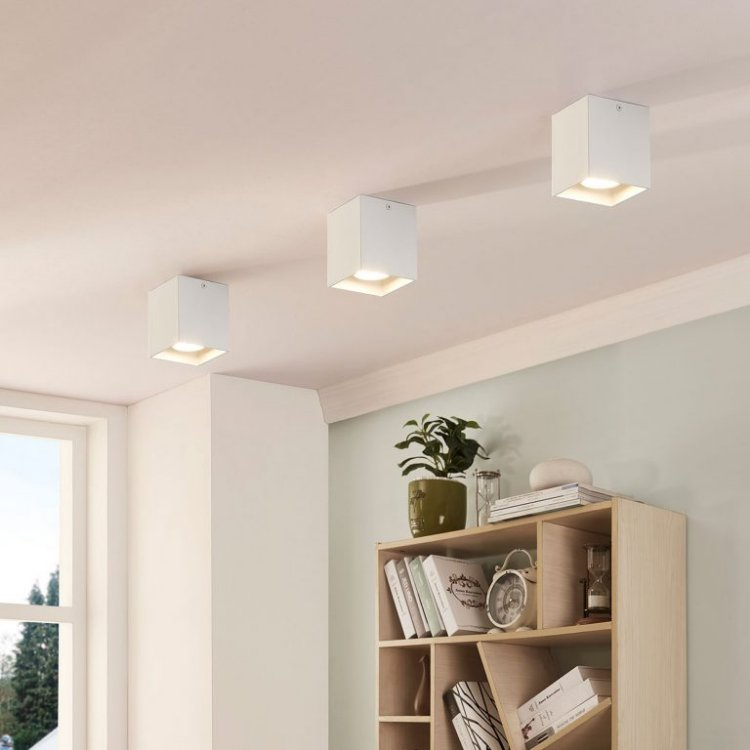
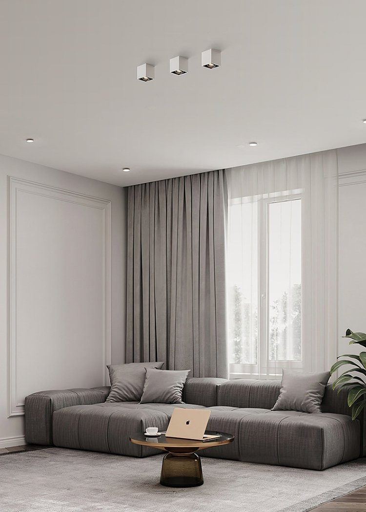

*Khi lên kế hoạch trang trí nhà cửa, bạn đã có giải pháp làm nổi bật không gian bằng ánh sáng và bổ sung phụ kiện? Những chiếc đèn spotlight vuông 10W ốp nổi 36 độ sẽ giúp bạn hô biến cho không gian sống thường ngày trở nên có hồn và phong cách hơn.*

*Đèn spotlight vuông 10w ốp nổi 36 độ sử dụng trong không gian*
## **1. Đặc điểm của đèn spotlight vuông ốp nổi 10w**
Với “nhiệm vụ” chính là trang trí, chiếu sáng nội thất, ngoại thất, những chiếc đèn spotlight ốp nổi sở hữu cả thiết kế bên ngoài và ánh sáng độc đáo. Nhìn tổng thể, bạn sẽ thấy phần trần nhà mình khi được nhấn nhá bằng những chiếc đèn spotlight này trở nên hiện đại và phá cách, tạo ấn tượng về sự trẻ trung, thời thượng.
## **2. Ưu điểm của đèn spotlight vuông ốp nổi 10w**
- **Ánh sáng an toàn cho mắt:** ánh sáng phát ra từ đèn LED, hạn chế tia hồng ngoại và tia UV. Ngoài ra, ánh sáng êm dịu và khuếch tán tốt, không mang lại cảm giác chói mắt cho người nhìn.
- **Chất liệu bền bỉ:** Chất liệu nhôm đúc bền bỉ theo thời gian, cho phép đèn phù hợp với cả công dụng chiếu sáng trong nhà và khu vực hành lang, đem đến nhiều sự lựa chọn đa dạng cho người dùng
- **Tạo phong cách hiện đại:** không cầu kì về thiết kế, đèn spotlight vuông ốp nổi 10w lại tạo ấn tượng tốt về sự tinh tế với hình khối vuông trắng tối giản
- **Độ bền, tuổi thọ cao:** chất liệu cao cấp bền bỉ, tuổi thọ trên 25000 giờ
- **Thân thiện với môi trường:** đèn LED không chứa thủy ngân và tỏa ra ít nhiệt hơn các dòng đèn huỳnh quang, sợi đốt, vì thế hạn chế được nhiều tác động tiêu cực đối với môi trường xung quanh.
- **Tích hợp với hệ sinh thái nhà thông minh**: Người dùng hoàn toàn có thể tích hợp mẫu đèn này với [***Lumi smart home***](https://lumi.vn/), từ đó có thể tạo ra các rule, cảnh, lịch phù hợp với từng mục đích khác nhau.
## **3. Ứng dụng của đèn spotlight vuông ốp nổi 10w**
Nhờ vào thiết kế đơn giản, đèn spotlight gắn nổi khối vuông có thể được lắp đặt trên nhiều chất liệu trần và khu vực khác nhau như phòng khách, phòng ngủ. Đặc biệt, những ngôi nhà với phong cách kiến trúc hiện đại sẽ rất phù hợp để tăng tính thẩm mỹ với dòng đèn này.

*Đèn spotlight vuông ốp nổi là phụ kiện trang trí cho không gian hiện đại*

Không chỉ chiếu sáng cho nhà ở, đèn spotlight ốp nổi 10w khối vuông còn xuất hiện ở các phòng họp, phòng hội thảo, khu nghỉ dưỡng,… để mang lại cảm giác thư giãn và xóa tan sự tẻ nhạt cho khu vực được chiếu sáng. Tính tối giản của chiếc đèn spotlight vuông giúp cho người dùng dễ dàng ứng dụng dòng đèn này vào đời sống thường ngày.

Khi tích hợp đèn spotlight vuông 10W ốp nổi 36 độ vào hệ thống smarthome (sử dụng cùng công tắc thông minh Lumi), bạn có thể cài đặt để thể hiện thiết kế chiếu sáng trong ngôi nhà, bật/tắt các thiết bị đèn spotlight gắn nổi bằng smartphone hoặc giọng nói.

Những gia chủ lần đầu “thay áo mới” cho không gian sống bằng ánh sáng có thể gặp ít nhiều khó khăn khi lựa chọn và lên kế hoạch bài trí đèn. Các chuyên gia thiết kế chiếu sáng từ Lumi sẽ giúp bạn đưa ra quyết định với những bản vẽ tối ưu các nguồn sáng và đạt hiệu quả cao về thẩm mỹ. Hãy liên hệ ngay Lumi để được tư vấn và đồng hành trong cuộc “cách mạng” nâng cấp mái ấm của bạn.

**Xem thêm các mẫu đèn bán chạy của Lumi:**

- [***Đèn spotlight âm trần 10W 36 độ chỉnh hướng***](https://lumi.vn/san-pham/den-spotlight-am-tran-10w-36-do-chinh-huong.html)
- [***Đèn spotlight 12W***](https://lumi.vn/san-pham/den-spotlight-12w-tunable-white.html)
- [***Đèn âm tủ mini 3W***](https://lumi.vn/san-pham/den-spotlight-am-tu-mini-3w-chinh-huong.html)
