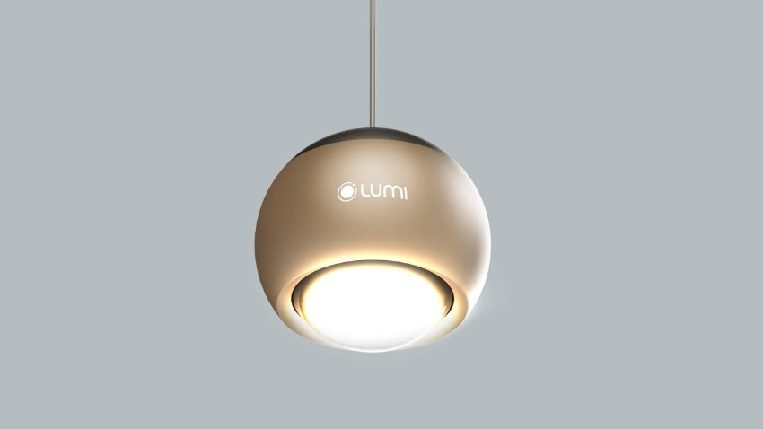

*Đèn thả Lumi 10W không chỉ được biết đến với ánh sáng tuyệt vời mà còn thu hút người dùng bởi thiết kế độc đáo và hiện đại. Với thiết kế trang nhã, sang trọng, đèn thả Lumi 10W có thể phù hợp với mọi phong cách nội thất và không gian sống. Bạn có thể lựa chọn đèn thả Lumi 10W với kiểu dáng trang nhã và tinh tế, hoặc bạn cũng có thể chọn một thiết kế độc đáo, nổi bật để tạo điểm nhấn cho không gian của mình.*
### **1. Đèn thả Lumi 10W có thiết kế tinh tế, hiện đại, bền bỉ vượt thời gian**
- Mỗi thiết kế đèn Spotlight đều được chăm chút tỉ mỉ đến từng chi tiết. Các vật liệu cao cấp kết hợp các công nghệ anode, mạ cao cấp giúp các thiết bị phù hợp với không gian từ sang trọng đến tối giản.
- Màu sắc của đèn là màu champagne sang trọng, phù hợp với nhiều phòng cách nhà ở khác nhau.

*Đèn thả Lumi 10W có thiết kế tinh tế, hiện đại, bền bỉ vượt thời gian*
### **2. Ánh sáng tạo cảm xúc, gia vị tạo điểm nhấn**
- Các thiết kế đèn Mini Spotlight trong bộ sưu tập lần này đều mang đến chất lượng ánh sáng lí tưởng với chỉ số hoàn màu CRI >90 (Color Rendering Index).
- Nhiệt độ màu thay đổi linh hoạt tạo nên điểm nhấn và chiều sâu cho mỗi không gian sống, mang lại cảm xúc chân thật hơn trong mỗi khoảnh khắc.

*Đèn thả Lumi 10W có ánh sáng chất lượng cao*
### **3. Công năng đa dạng, kịch bản chiếu sáng linh hoạt**
Khách hàng có đầy đủ lựa chọn cho toàn bộ nhu cầu chiếu sáng trong không gian sống với Lumi Spotlight. Đèn cho phép thay đổi góc chiếu và linh hoạt điều chỉnh nhiệt độ màu, cường độ sáng bằng Smartphone. Kịch bản chiếu sáng linh hoạt cũng được tùy chỉnh theo ý gia chủ nhờ công tắc cảnh hoặc smartphone.

*Công năng đa dạng, kịch bản chiếu sáng linh hoạt*

*Các sản phẩm Lumi Lighting kết hợp trong không gian sống*
### **4. Một mảnh ghép trong hệ sinh thái Smarthome**
Khách hàng có thể sử dụng đèn Lumi Mini Spotlight như là đèn chiếu sáng đơn lẻ hoặc một phần trong hệ thống các nhóm đèn để tạo ra những kịch bản chiếu sáng khác nhau trên Smartphone. Đặc biệt, kết hợp với các thiết bị thông minh khác trong nhà các sản phẩm đèn Spotlight của Lumi giúp bạn trải nghiệm một ngôi nhà thông minh với trọn vẹn cảm xúc sống.

*Đèn có thể tạo kịch bản chiếu sáng linh hoạt với hệ sinh thái smarthome*

*Sản phẩm trong BST Lumi Lighting dễ dàng kết hợp với các thiết bị smarthome khác*
