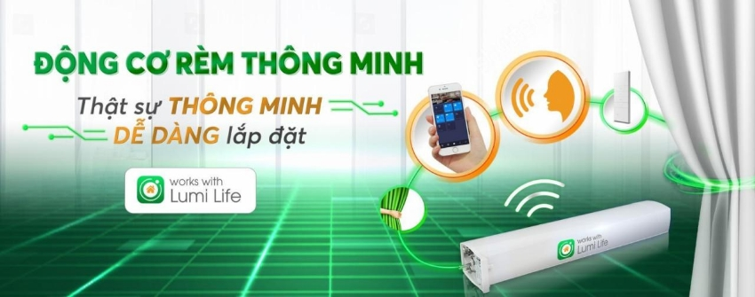
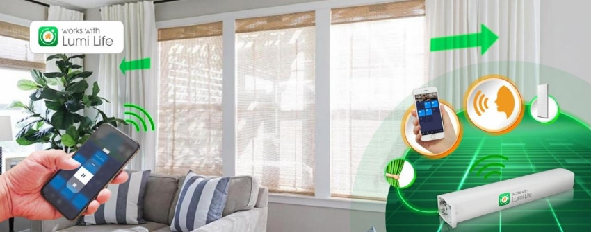
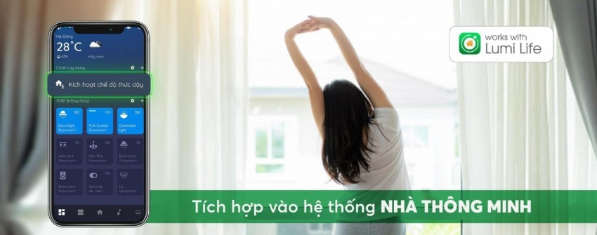

*Trong thời đại công nghệ 4.0 hiện nay, cuộc sống ngày càng trở nên tiện lợi và thông minh hơn nhờ sự phát triển của các thiết bị kết nối internet. Một trong những sản phẩm đột phá mang tính cách mạng trong lĩnh vực này chính là **động cơ rèm thông minh** hay còn gọi là motor rèm cửa tự động. Với khả năng tự động đóng mở rèm hoặc điều khiển rèm đóng/mở thông qua điện thoại thông minh, động cơ rèm thông minh đã mang đến sự tiên ích vượt trội cho người dùng. Từ đó có thể tiết kiệm thời gian hơn cũng như có thể tận hưởng sự tiện nghi thông minh trong chính ngôi nhà của bạn.*

*Video giới thiệu sản phẩm động cơ rèm Thông minh Lumi*
## **1. Giới thiệu về động cơ rèm thông minh Works With Lumi Life**
- Động cơ rèm thông minh Works With Lumi là động cơ điều khiển rèm có tích hợp sẵn module Zigbee bên trong sản phẩm; cho phép người dùng thuận tiện điều khiển rèm tự động thông minh bằng Smartphone hoặc giọng nói.
- Bên cạnh 2 cách điều khiển thông thường là dùng motor kéo rèm hoặc kéo tay. Sự ra đời của mô tơ kéo rèm Works With Lumi sẽ tối ưu giải pháp rèm tự động vốn có của Nhà thông minh Lumi; mang lại trải nghiệm sống vượt trội cho gia đình hiện đại

*Động cơ rèm thông minh, motor kéo rèm thông minh dễ dàng lắp đặt*

\>>Xem thêm sản phẩm khác: [***Ổ cắm mặt kính cường lực***](https://lumi.vn/san-pham/o-cam-mat-kinh-cuong-luc-chong-xuoc.html)
## **2. Các tính năng của motor rèm cửa tự động Works With Lumi**
- Chúng ta không còn xa lạ gì với việc sử dụng một chiếc remote để điều khiển các bộ rèm tự động thông minh. Tuy nhiên, với động cơ rèm thông minh của Lumi, chiếc remote thông thường không phải là phương tiện điều khiển từ xa duy nhất nữa.
- Chủ nhân những ngôi nhà hiện đại có thể sử dụng chính chiếc Smartphone của mình để thực hiện nhiều chức năng hơn so với việc chỉ đóng/ mở rèm. Cụ thể:

*Tính năng của motor rèm thông minh Lumi*

- Đóng/ mở rèm cửa bằng cách chạm nhẹ trên Smartphone
- Hẹn giờ đóng/ mở rèm vào các thời gian cố định trong ngày
- Điều khiển rèm bằng giọng nói với trợ lý ảo Google Assistant, Apple Siri, Amazon Alexa
- Điều khiển rèm đồng bộ với các kịch bản Nhà thông minh
## **3. Các ưu điểm của động cơ rèm thông minh Works With Lumi Life**
### ***3.1. Động cơ rèm cửa hoạt động êm ái, bền bỉ với kết nối ổn định***
- Động cơ rèm thông minh của Lumi hoạt động ổn định với trọng lượng tải khoảng 50kg và sử dụng kết nối không dây Zigbee để kết nối với thiết bị điều khiển. Với độ ồn được kiểm soát tốt, động cơ rèm tự động sẽ hoạt động êm ái và không gây khó chịu cho người dùng trong quá trình sử dụng.
- Bên cạnh đó, với cảm biến nhiệt được tích hợp trong sản phẩm, rèm sẽ tự động dừng nếu cảm biến phát hiện nhiệt độ hoạt động của động cơ đang ở mức cảnh báo, từ đó mang lại sự bền bỉ cho hoạt động của động cơ
### ***3.2. Đồng bộ hiển thị trạng thái rèm chính xác và sẵn sàng tích hợp vào hệ thống Nhà thông minh***
- Mọi thay đổi trạng thái của rèm dù là điều khiển bằng app Lumi Life hay người dùng kéo rèm bằng tay thì đều sẽ được cập nhập chính xác trạng thái lên trên ứng dụng dụng Lumi Life.
- Motor rèm cửa tự động sẽ giúp rèm cửa có thể kết nối với các thiết bị thông minh khác trong nhà để tạo nên các kịch bản sống đa dạng phục vụ cho nhiều mục đích sử dụng

*Động cơ rèm tích hợp vào nhà thông minh smart home*

\>> Xem thêm sản phẩm an ninh nổi bật của Lumi:

- [***Camera cảnh báo Lupa Bullet***](https://lumi.vn/san-pham/camera-canh-bao-lupa-bullet.html)
- [***Camera cảnh báo Lupa Turret thông minh***](https://lumi.vn/san-pham/camera-canh-bao-lupa-turret.html)
### ***3.3. Motor kéo rèm giúp tiết kiệm chi phí cho giải pháp rèm, cho phép người dùng dễ dàng lắp đặt***
- Thông thường, khi muốn sử dụng động cơ để điều khiển rèm; chủ nhà sẽ cần thêm một công tắc điều khiển trên tường. Điều này sẽ gây khó khăn cho công tác lắp đặt trong trường hợp hạ tầng đế âm chưa sẵn sàng; đòi hỏi phải xử lý.
- Mỗi công tắc sẽ chỉ điều chỉnh được một bộ rèm cố định, điều này thực sự bất tiện đối với các ngôi nhà sử dụng nhiều rèm. Tất cả những nhược điểm này hoàn toàn được khắc phục trong sản phẩm động cơ rèm cửa Lumi.
- Với nhân IOT được lập trình và cài đặt tích hợp ngay trong chính động cơ, công tắc điều khiển sẽ trở nên hoàn toàn không cần thiết, giúp chủ nhà tiết kiệm thêm một phần chi phí vốn phải dành cho các công tắc thông minh.
### ***3.4. Động cơ rèm tự động thông minh Works With Lumi Life đạt chứng nhận FCC***
- Chứng nhận FCC là chứng nhận của Uỷ ban Truyền thông Liên Bang Hoa Kỳ được áp dụng cho các thiết bị điện tử phát sóng Radio.
- Chứng nhận FCC, thiết bị động cơ rèm cửa Lumi được chứng nhận đảm bảo an toàn về mặt chất lượng không bị nhiễu động quá mức khi sử dụng.
- Thông thường, chứng nhận FCC thường được thấy trên điện thoại thông minh như iPhone, Samsung,…
## **4. Cách thức hoạt động của motor rèm cửa tự động**
Khi người dùng sử dụng Smartphone hoặc giọng nói để điều khiển rèm thông minh, tín hiệu sẽ được truyền từ smartphone tới Server quản lý của Lumi, từ đó truyền lệnh về Curtain Controller (Bộ điều khiển trung tâm rèm). Nhờ vậy, dù đang ở cơ quan hay đi du lịch, bạn vẫn có thể điều khiển rèm qua Smartphone chỉ cần có kết nối Internet.

*Cách thức động cơ rèm thông minh Lumi hoạt động*
## **5. Ứng dụng của động cơ rèm cửa tự động thông minh**
Đông cơ rèm thông minh Lumi hay động cơ rèm cuốn tự động có thể ứng dụng cho rất nhiều mẫu rèm cửa khác nhau. Cụ thể:
### ***5.1. Làm động cơ rèm cuốn tự động***
- Động cơ rèm hỗ trợ rèm tự động cuốn lên hoặc cuốn xuống bằng cách sử dụng remote hoặc điều khiển từ xa bằng điện thoại.
- Động cơ rèm cuốn tự động có khả năng tương thích với các hệ thống nhà thông minh và là một phần quan trọng của việc tự động hóa ngôi nhà.
### ***5.2. Làm động cơ rèm kéo thông minh***
- Rèm kéo thông minh là sản phẩm trang trí có khả năng tự động kéo lên và kéo xuống thông qua việc sử dụng công nghệ điều khiển từ xa.
- Với thiết kế thông minh, rèm kéo tự động tạo nên sự tiện lợi và hiện đại, giúp điều chỉnh ánh sáng và sự riêng tư một cách dễ dàng.
### ***5.3. Làm động cơ rèm vải tự động***
- Động cơ rèm vải tự động là một hệ thống tự động hoá giúp điều khiển việc mở và đóng rèm vải một cách tự động.
- Hệ thống này sử dụng động cơ rèm vải thông minh để điều chỉnh rèm đêm, rèm ngay; tạo ra sự tiện lợi và hiện đại trong việc quản lý ánh sáng và riêng tư trong không gian.

Trên đây là những thông tin về đông cơ rèm tự động thông minh hay motor kéo rèm thông minh. Để nhận được những thông chi tiết về tích hợp sản phẩm trên vào [***Lumi Smarthome***](https://lumi.vn/), hãy gọi ngay hotline hoặc để lại thông tin tại form liên hệ để có thể nhận được sự tư vấn chi tiết từ tư vấn viên.
