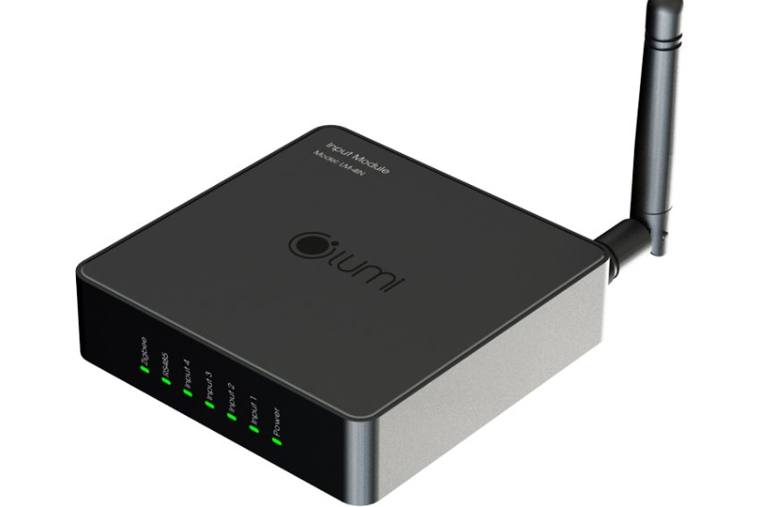

*Input Module được thiết kế tinh tế, sang trọng, giúp làm sang hơn không gian sống của bạn. Đây là sản phẩm độc đáo nhất của nhà thông minh Lumi 2019. Với chức năng kết hợp với đa dạng thiết bị nhà thông minh khác, giúp bạn mở rộng hơn các tính năng thông minh cho ngôi nhà của mình. Tìm hiểu kỹ hơn về sản phẩm qua những thông tin dưới đây.*
## **1. Đặc điểm Input Module**
- Với hạ tầng IOT mở, bạn có thể tích hợp các thiết bị thông minh khác vào mà không lo bị hạn chế, ngôi nhà của bạn được mở rộng vô tận với các tính năng thông minh, Input Module là một sản phẩm rất hữu hiệu cho mọi giải pháp.
- Các thiết bị, giải pháp mà bạn có thể tích hợp với nhà thông minh Lumi qua Input Module có thể kể đến: Khóa vân tay – Cảm biến hàng rào – Cảm biến khói – Cảm biến khí ga – Cảm biến khí CO – Cảm biến chuyển động …

*Input Module có thiết kế sang trọng*

Xem thêm sản phẩm module âm thanh cao cấp:

- [***Module âm thanh đa vùng V3.1***](https://lumi.vn/san-pham/multi-audio-v3-1.html)
- [***Module âm thanh đa vùng v2 Lumi***](https://lumi.vn/san-pham/multi-audio.html)
## **2. Chức năng của thiết bị**
- Sản phẩm hỗ trợ chuyển đổi tín hiệu từ các cảm biến không tích hợp Zigbee nhưng có đầu ra dry contact hoặc wet contact vào **bộ điều khiển trung tâm nhà thông minh** của Lumi. Sản phẩm hỗ trợ tối đa 4 đầu vào độc lập.
- Với thiết kế sử dụng công nghệ kết nối không dây ZigBee, khi được kết nối tới bộ điều khiển trung tâm, thiết bị LM-INPUT giúp các cảm biến hãng khác làm đầu vào tạo rule hoạt động trong hệ thống phòng thông minh.
## **3. Phương thức hoạt động của module**
- Khi có sự thay đổi tín hiệu tại mỗi kênh đầu vào, thiết bị sẽ truyền tín hiệu đến bộ điều khiển trung tâm (HC). Tại đây, bộ điều khiển trung tâm sẽ gửi thông tin trạng thái lên giao diện APP đồng thời kích hoạt các ngữ cảnh được thiết bị.
- Giám sát và điều khiển qua App Lumi Life
- Quan sát hình ảnh thiết bị trên app để biết hoạt động, trạng thái của cảm biến đang kết nối:
  - Bật: Cảm biến bật, icon sáng
  - Tắt: Cảm biến tắt, icon tối
- Nhờ có sự kết nối đồng bộ này, các thiết bị trong nhà của bạn được giám sát và điều khiển tiện lợi nhất thông qua apps Lumi Life trên điện thoại.

*Modul Input tiện ích*

Xem thêm sản phẩm module nổi bật: [***Module 2 in – 2 out Zigbee Lumi***](https://lumi.vn/san-pham/module-2-in-2-out-zigbee.html)
## **4. Lắp đặt Input Module**
- Đầu tiên bạn cần cấp nguồn và cho thiết bị gia nhập mạng.
- Thiết bị LM-INPUT của Lumi được thiết kế sử dụng nguồn điện 9-24VDC. Vì vậy, bạn cần lưu nguồn điện hợp lý, tránh cháy, nổ.
- Tiếp theo là đấu dây thiết bị
- Cài đặt trên máy tính
- Gia nhập mạng
- Reset thiết bị
- Sau khi cấp nguồn, thiết bị tự động tìm kiếm mạng để gia nhập. Đèn chỉ thị nháy hồng 3 lần thiết bị gia nhập mạng thành công.

Thiết bị tìm kiếm mạng trong 5 phút, nếu thiết bị không gia nhập mạng, quý khách hàng tiến hành reset thiết bị.

Muốn tìm hiểu thêm về các giải pháp [**smarthouse**](https://lumi.vn/) cho ngôi nhà của bạn hiện đại đẳng cấp hơn, bạn có thể liên hệ tới: **090.466.59.65**
