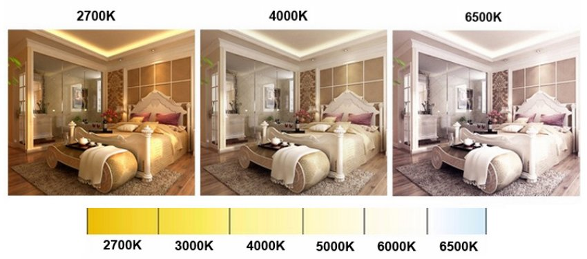
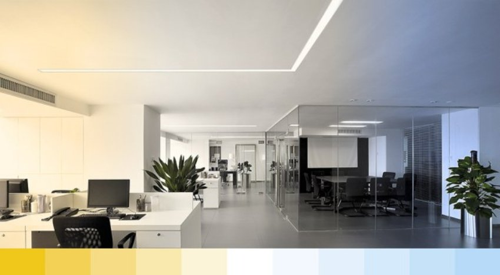

*Đèn LED dây thông minh 1 màu (3000K/4000K) được trang bị khả năng điều khiển từ xa thông qua điện thoại, giọng nói và ngữ cảnh, đèn LED này cho phép bạn tạo ra không gian ánh sáng theo ý muốn. Vậy mẫu đèn này có những đặc điểm gì? Ưu điểm ra sao? Và ứng dụng ở những không gian nào? Tìm hiểu chi tiết hơn về sản phẩm trong bài viết dưới đây.*
## **1. Đặc điểm đèn LED dây thông minh 1 màu**
- Đèn LED dây thông minh Tunable White là một sản phẩm nằm trong bộ giải pháp Lumi Smart Lighting, vừa được giới thiệu cuối năm 2020.
- Sử dụng LED dây này trong nhà, bạn có thể thiết lập ánh sáng có nhiệt độ màu 3000K, hoặc 4000K mang lại ánh sáng phù hợp cho từng góc nhỏ của ngôi nhà.
- Để kích hoạt ánh sáng, bạn chỉ cần truy cập ứng dụng [Lumi Life](https://apps.apple.com/us/app/lumi-life/id1418907250) trên Smartphone.

*LED dây thông minh 1 màu*

\>> Xem thêm sản phẩm nổi bật khác: [***Đèn gắn tường ngoài trời hình cầu 2*3W***](https://lumi.vn/san-pham/den-gan-tuong-ngoai-troi-hinh-cau-2x3w.html)
## **2. Những ứng dụng của đèn LED dây thông minh 1 màu 3000K, 4000K**
- Là thiết bị chiếu sáng mang mục đích thiên về trang trí nhà cửa, đèn LED với các mắt LED cho phép chủ nhân kích hoạt ánh sáng ở mức nhiệt độ màu 3000K hoặc 4000K tuỳ theo sản phẩm dây LED sử dụng.
- Với đặc trưng là loại đèn LED dây, sản phẩm thường được lắp đặt tại những góc không gian hẹp, và được giấu vào phía trong; không lô ra nguồn phát sáng. Khi kích hoạt chiếu sáng, người nhìn sẽ chỉ thấy màu ánh sáng chứ không thấy nguồn phát ra.

*Ứng dụng của đèn LED dây thông minh 3000K/4000K*

\>> Xem thêm sản phẩm mới: [***Đèn LED gắn tường hình vuông 2*6w***](https://lumi.vn/san-pham/den-gan-tuong-ngoai-troi-hinh-vuong-2x6w.html)

- LED dây thông minh 3000K, 4000K thường được lắp đặt tại khe rỗng trên trần nhà, tủ trưng bày rượu, hoặc khoảng trống dưới kệ đặt tivi.
- Nhờ vào ánh sáng phát ra từ dây LED, các đồ vật trong nhà trở nên lung linh và có hồn hơn, mang tới cảm giác sang trọng, hoặc phá cách theo từng ý đồ bày trí trong nhà.
## **3. Ưu điểm của đèn LED dây thông minh 1 màu 3000K, 4000K**
- Cho phép bật/ tắt/ hẹn giờ đèn bằng Smartphone và giọng nói
- Chủ nhà dễ dàng điều khiển đèn hoặc các cụm đèn bằng smartphone, công tắc hoặc bằng giọng nói
- Ứng dụng công nghệ chiếu sáng lấy con người làm trung tâm (Human Centric Lighting – HCL) giúp cải thiện nhịp sinh học 
- Tuổi thọ đèn kéo dài đến 25000 giờ chiếu sáng, tương đương với hơn 10 năm (trung bình chiếu sáng 6h/ ngày)
- Ánh sáng trung thực với mắt người với độ hoàn màu CRI > 80
- Dễ dàng kết hợp cùng các thiết bị thông minh Lumi khác để tạo ra các kịch bản sống tiện ích

Đèn LED Dây Thông Minh 1 Màu không chỉ đáp ứng nhu cầu ánh sáng mà còn thể hiện sự tinh tế và tùy chỉnh tạo nên không gian cá nhân. Từ đó tạo nên những khoảnh khắc sáng sủa và thú vị hơn bao giờ hết trong cuộc sống. Để liên hệ tư vấn và thiết kế chiếu sáng cho ngôi nhà của bạn, hãy liên hệ hotline Lumi, nhân viên tư vấn sẽ sẵn sàng hỗ trợ 24/7.

\>> Xem thêm sản phẩm đèn ngoài trời nổi bật: [***Đèn LED gắn tường bán nguyệt ngoài trời 2*5w***](https://lumi.vn/san-pham/den-gan-tuong-ngoai-troi-ban-nguyet-2x5w.html)
