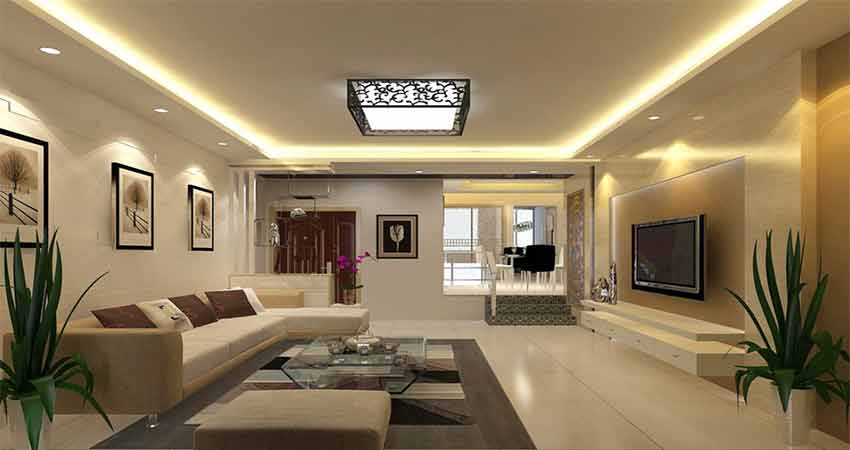
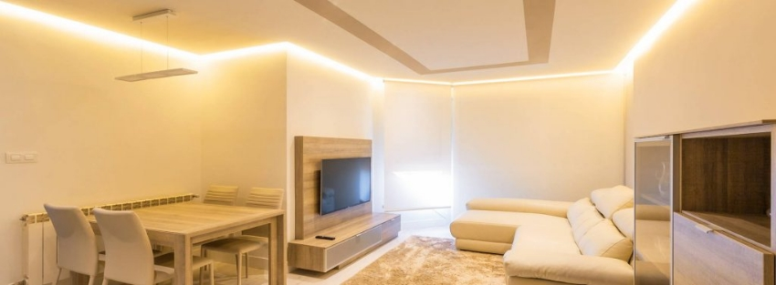
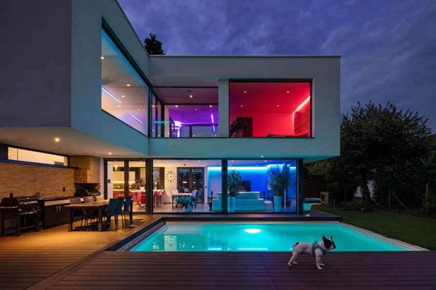

*Đèn LED dây thông minh RGB 16 triệu màu tiêu thụ ít năng lượng hơn so với các loại đèn truyền thống; giúp giảm hóa đơn tiền điện và bảo vệ môi trường. Với khả năng thay đổi 16 triệu màu sắc, đèn LED dây thông minh cho phép bạn tùy chỉnh ánh sáng theo sở thích và tạo ra không gian sống độc đáo và riêng biệt. Đặc biệt khi tích hợp vào hệ thống [**nhà thông minh**](https://lumi.vn/), đèn có thể dễ dàng điều chỉnh màu sắc và bật tắt theo ý muốn thông qua smartphone. Tìm hiểu chi tiết sản phẩm thông qua các thông tin dưới đây.*
## **1. Đèn LED dây thông minh RGB 16 triệu màu**
- Đèn LED dây thông minh RGB 16 triệu màu là một sản phẩm chiếu sáng được sử dụng nhiều trong không gian nhà ở để đạt được mục đích chiếu sáng thẩm mỹ.
- Đèn LED dây thường có hình dáng là những cuộn tròn được bố trí nhiều mắt LED suốt dọc sợi dây, đồng thời cho phép uốn dẻo, tạo hình.
- Đèn LED được ứng dụng nhiều trong việc trang hoàng nhà cửa, mang đến những ánh sáng vô cùng sinh động và đa dạng, làm tăng thêm vẻ đẹp của ngôi nhà hiện đại.

*Đèn LED dây RGB 16 triệu màu thông minh lắp đặt tại phòng khách*

\>> Xem thêm mẫu đèn ngoài trời mới: [***Đèn gắn tường hình cầu 2*3W ngoài trời***](https://lumi.vn/san-pham/den-gan-tuong-ngoai-troi-hinh-cau-2x3w.html)
## **2. Ứng dụng của đèn LED dây 16 triệu màu RGB thông minh**
- Là [***đèn thông minh***](https://lumi.vn/den-led-thong-minh) mang mục đích thiên về trang trí nhà cửa, đèn LED dây 16 triệu màu nằm trong bộ thiết bị Lumi Smart Lighting cho phép đổi màu trong bảng RGB 16 triệu màu sắc.
- Đèn 16 triệu màu cao cấp thường được lắp tại những góc không gian hẹp và được giấu vào phía trong, không lộ ra nguồn phát sáng. Khi kích hoạt chiếu sáng, người nhìn sẽ chỉ thấy màu ánh sáng chứ không thấy nguồn phát ra.

*Ứng dụng của đèn LED dây 16 triệu màu RGB thông minh*

- Với công nghệ chiếu sáng thông minh tích hợp vào đèn LED dây 16 triệu màu cao cấp Lumi, bạn có thể sử dụng Smartphone để đổi màu không gian theo ý muốn.
- Người dùng có thể cài đặt thay đổi màu không gian theo giờ, hoặc tận dụng ánh sáng đa màu sắc, kết hợp cùng âm nhạc để tạo nên những bữa tiệc sôi động tràn đầy hứng khởi.
## **3. Ưu điểm của đèn LED dây thông minh RGB 16 triệu màu Lumi**

*LED dây thông minh RGB tạo không gian lãng mạn cho ngôi nhà*

Đèn 16 triệu màu của Lumi có nhiều ưu điểm nổi bật. Cụ thể:

- Đèn LED dây thông minh RGB 16 triệu màu là sự lựa chọn hoàn hảo để tạo không gian sáng tạo và phong cách cho nhiều công trình khác nhau.
- Sản phẩm không chỉ mang lại tính linh hoạt cao mà còn giúp bạn điều khiển đèn bằng smartphone và giọng nói một cách dễ dàng. Điều này không bị ảnh hưởng bởi hạ tầng điện, đảm bảo rằng bạn luôn có quyền kiểm soát màu sắc và ánh sáng.
- Công nghệ chiếu sáng lấy con người làm trung tâm (Human Centric Lighting – HCL) là điểm nhấn độc đáo, giúp cải thiện nhịp sinh học và tăng cường cảm giác thoải mái.
- Đèn này có tuổi thọ đáng kinh ngạc lên đến 25000 giờ chiếu sáng; tương đương với hơn 10 năm sử dụng trung bình 6 giờ mỗi ngày. Điều này không chỉ tiết kiệm chi phí mà còn tạo sự ổn định và bền bỉ cho không gian của bạn.
- Với khả năng dễ dàng kết hợp cùng các thiết bị thông minh Lumi khác, bạn có thể tạo ra những kịch bản sống tiện ích; tạo ra môi trường sống và làm việc thông minh, tiện nghi và thú vị từ những chút ánh sáng đa dạng và tươi sáng của LED dây thông minh RGB 16 triệu màu.

Trên đây là thông tin chi tiết về đèn LED dây thông minh RGB 16 triệu màu. Để nhận được tư vấn chi tiết về ứng dụng đèn LED 16 triệu màu RGB vào nhà thông minh, hãy gọi ngay đến hotline của Lumi, đội ngũ tư vấn sẽ hỗ trợ nhanh chóng và chi tiết nhất.

**>> Tham khảo thêm các mẫu đèn LED dây khác:**

- [***Đèn LED dây thông minh Tunable White WW***](https://lumi.vn/san-pham/den-led-day-thong-minh-tunable-white.html)
- [***Đèn LED dây thông minh 1 màu***](https://lumi.vn/san-pham/den-led-day-thong-minh-1-mau.html)
