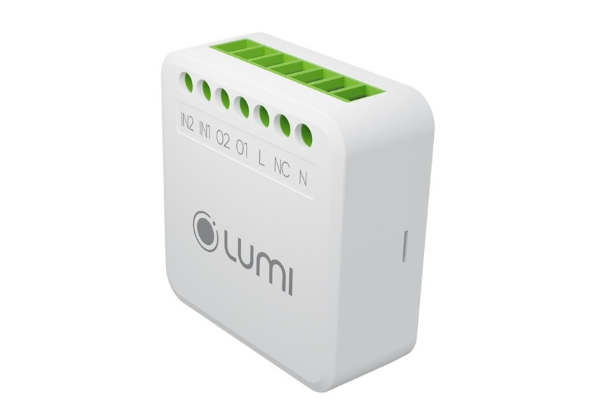

*Ngoài thiết bị công tắc điện thông minh, module 2 IN – 2 OUT /BLE cũng là một sự lựa chọn dành cho khách hàng không muốn thay thế công tắc cơ truyền thống, nhưng lại muốn trải nghiệm những tính năng của Nhà thông minh Lumi. Với thiết kế hình hộp chữ nhật nhỏ gọn, kích thước chỉ khoảng 1 bao diêm, module 2 in 2 out dễ dàng khiến cho ngôi nhà trở nên thông minh hơn và được lắp đặt kín đáo tại trong phần đế âm của công tắc.*
## **1. Ứng dụng của module 2 in – 2 out /BLE trong nhà thông minh**
Được mô tả là dành cho những người yêu thích thiết kế và trải nghiệm bật/ tắt truyền thống của công tắc cơ, nhưng vẫn muốn biến các thiết bị điện trong nhà trở thành thiết bị thông minh, module 2in – 2out cho phép người dùng thực hiện những tính năng thông minh như sau

- Bật/ tắt hệ thống đèn bằng Smartphone và giọng nói
- Bật/ tắt bình nóng lạnh bằng Smartphone
- Lên lịch/ hẹn giờ các thiết bị đèn, bình nóng lạnh theo lịch sinh hoạt của gia đình
- Tạo nhóm các thiết bị cùng loại trong mạng Bluetooth, là tín hiệu đầu vào để kích hoạt các Rule, cảnh, lịch

*Module 2 iIn 2 Out/BLE*
## **2. Phương thức hoạt động của module 2 in – 2 out Bluetooth Mesh**
- Module 2in – 2out có 2 tải đầu vào và 2 tải đầu ra và được lắp đặt trong phần đế âm của công tắc. Hiểu 1 cách đơn giản, khi người dùng ấn nút công tắc, tín hiệu này sẽ truyền tới tải 1 của module.
- Tín hiệu này được coi là 1 tín hiệu đầu vào. Từ vị trí tải 1 của module, tín hiệu sẽ được truyền tới tải đầu ra 1 của module. Tải đầu ra này được nối trực tiếp tới thiết bị điện.
- Khi sử dụng smartphone để điều khiển, tín hiệu sẽ truyền từ Smartphone tới Bộ điều khiển trung tâm. Sau khi được xử lý, tín hiệu sẽ gửi tới module 2in – 2out, rồi truyền tới thiết bị để thực hiện lệnh.
- Nhờ module 2in 2out, khách hàng có thêm 1 sự lựa chọn để thiết lập một hệ thống Nhà thông minh Lumi không cần can thiệp hạ tầng, và thậm chí không cần thay công tắc cơ có sẵn.
## **3. Tính năng của Module 2 in 2 out /BLE**
- Điều khiển bật/tắt cho đầu ra là các thiết bị điện: Module 2 in 2 out /BLE hỗ trợ 2 đầu vào và 2 đầu ra, cho phép bạn dễ dàng điều khiển các thiết bị điện. Bạn có thể bật hoặc tắt các thiết bị điện từ xa một cách thuận tiện và nhanh chóng.
- Đầu ra kết nối và điều khiển các thiết bị điện: Module này có khả năng kết nối và điều khiển các thiết bị điện, giúp bạn tạo môi trường chiếu sáng và điện năng tiện ích và hiệu quả.
- Đầu vào cấu hình làm tín hiệu kích hoạt cho Rule/Cảnh/Lịch: Đầu vào của Module có thể được cấu hình để làm tín hiệu kích hoạt cho các chế độ Rule, Cảnh và Lịch; giúp tự động hóa việc điều khiển và tạo các hoạt động thông minh dựa trên các điều kiện và thời gian nhất định.
- Kết nối không dây qua Bluetooth: Module 2 in 2 out /BLE sử dụng công nghệ kết nối không dây Bluetooth, tiết kiệm năng lượng và tăng cường tính bảo mật trong việc điều khiển thiết bị.
- Điều khiển từ xa thông qua Internet: Sử dụng ứng dụng Lumi Life + trên điện thoại di động, bạn có thể dễ dàng điều khiển Module từ xa thông qua Internet; giúp bạn kiểm soát các thiết bị điện một cách thuận tiện và linh hoạt từ bất kỳ đâu, mọi lúc.
- Điều khiển thông qua mạng LAN trong nhà: Ngoài việc điều khiển từ xa qua Internet, Module 2 in 2 out /BLE cũng hỗ trợ điều khiển thông qua mạng LAN trong nhà
- Cơ chế nhóm trực tiếp: Module này hỗ trợ cơ chế nhóm trực tiếp với các thiết bị cùng loại trong mạng Bluetooth; cho phép bạn tổ chức và điều khiển một nhóm thiết bị điện cùng một lúc, tạo sự thuận tiện và hiệu quả trong việc sử dụng.

Có thể nói tính năng của Module 2 in 2 out /BLE mang đến sự linh hoạt và tiện ích trong việc điều khiển các thiết bị điện. Bên cạnh đó tính năng hỗ trợ kết nối không dây qua Bluetooth và điều khiển từ xa thông qua Internet và mạng LAN, giúp tối ưu hóa việc sử dụng và tạo trải nghiệm nhà thông minh tiện lợi cho người dùng. Hãy gọi ngay hotline của Lumi để hẹn lịch trải nghiệm những tính năng thông mình của sản phẩm này ngay. Hotline: 0904 665 965.

\>> Tham khảo thêm các sản phẩm module tiện ích khác của Lumi:

- [***Module 5 In 1 – Zigbee***](https://lumi.vn/san-pham/module-5-in-1-zigbee.html)
- [***Module 5 In 1 BLE Mesh Lumi***](https://lumi.vn/san-pham/module-5-in-1-ble-mesh.html)
- [***Input Module cao cấp***](https://lumi.vn/san-pham/input-module.html)
