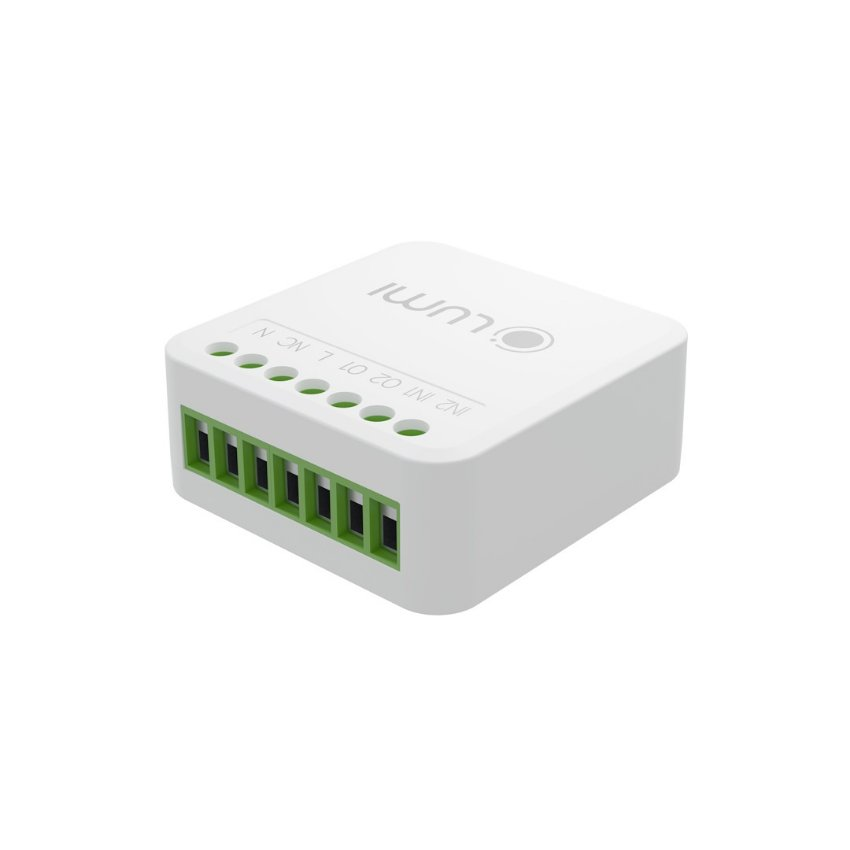

*Ngoài thiết bị công tắc điện thông minh, module 2IN – 2OUT cũng là một sự lựa chọn dành cho khách hàng không muốn thay thế công tắc cơ truyền thống, nhưng lại muốn trải nghiệm những tính năng của [**Nhà thông minh Lumi**](https://lumi.vn/).*
## **1. Đặc điểm Module 2 in – 2 out**
- Với thiết kế hình hộp chữ nhật nhỏ gọn, kích thước chỉ khoảng 1 bao diêm, module 2in 2out dễ dàng khiến cho ngôi nhà trở nên thông minh hơn và được lắp đặt kín đáo tại trong phần đế âm của công tắc.
- Ngoài sản phẩm module truyền thông Zigbee, Lumi còn có sản phẩm [***module 2 in – 2 out /BLE***](https://lumi.vn/san-pham/module-2-in-2-out-ble.html) có chức năng tương tự chỉ khác truyền thông BLE. Mọi người cần chú ý kỹ để tránh nhầm lẫn giữa 2 sản phẩm.

*Module 2 in – 2 out*
## **2. Ứng dụng của Module 2 in – 2 out trong nhà thông minh**
Được mô tả là dành cho những người yêu thích thiết kế và trải nghiệm bật/ tắt truyền thống của công tắc cơ, nhưng vẫn muốn biến các thiết bị điện trong nhà trở thành thiết bị thông minh, module 2in – 2out cho phép người dùng thực hiện những tính năng thông minh như sau:
### ` `**2.1. Bật/Tắt hệ thống đèn bằng smartphone và giọng nói**
- Với khả năng kết nối Zigbee, Module 2 in – 2 out cho phép bạn dễ dàng điều khiển hệ thống đèn bằng Smartphone. Bất kể bạn ở đâu, chỉ cần một vài lần chạm trên điện thoại, bạn có thể bật hoặc tắt đèn một cách thuận tiện và nhanh chóng.
- Ngoài ra, tích hợp giọng nói cũng giúp bạn tận dụng công nghệ tiên tiến để ra lệnh bật hoặc tắt đèn chỉ bằng cách nói lệnh, mọi thứ trở nên đơn giản và thú vị hơn.
### **2.2. Điều khiển bình nóng lạnh bằng smartphone**
- Không chỉ giới hạn ở việc điều khiển đèn, Module 2 in – 2 out / Zigbee còn giúp bạn kiểm soát bình nóng lạnh bằng Smartphone.
- Dù bạn muốn sưởi ấm cho buổi tắm vào buổi sáng hay chuẩn bị nước nóng cho cơm tối, chỉ cần một thao tác trên điện thoại, bạn có thể điều chỉnh nhiệt độ một cách dễ dàng và tiết kiệm thời gian.
### **2.3. Lên lịch/Hẹn giờ các thiết bị theo lịch sinh hoạt gia đình**
- Một tính năng độc đáo của Module 2 in – 2 out / Zigbee là khả năng lên lịch/hẹn giờ các thiết bị như đèn và bình nóng lạnh theo lịch sinh hoạt gia đình.
- Bạn có thể thiết lập thời gian bật/tắt tự động để phù hợp với thói quen hàng ngày của gia đình. Điều này giúp tạo ra sự tiện lợi và tiết kiệm năng lượng một cách thông minh.
### **2.4. Tạo nhóm các thiết bị cùng loại trong mạng Zigbee**
- Module 2 in – 2 out / Zigbee cho phép bạn tổ chức các thiết bị cùng loại thành nhóm trong mạng Zigbee. Đây là tín hiệu đầu vào quan trọng để kích hoạt các Rule, cảnh và lịch.
- Bạn có thể tạo ra các cài đặt tự động hoặc kịch bản tương tác giữa các thiết bị khác nhau, từ việc bật đèn khi bước vào nhà đến việc điều chỉnh nhiệt độ bình nóng lạnh theo thời gian.
## **3. Phương thức hoạt động của module 2in – 2out**
- Module 2in – 2out có 2 tải đầu vào và 2 tải đầu ra và được lắp đặt trong phần đế âm của công tắc. Hiểu 1 cách đơn giản, khi người dùng ấn nút công tắc, tín hiệu này sẽ truyền tới tải 1 của module. Tín hiệu này được coi là 1 tín hiệu đầu vào. Từ vị trí tải 1 của module, tín hiệu sẽ được truyền tới tải đầu ra 1 của module. Tải đầu ra này được nối trực tiếp tới thiết bị điện.
- Khi sử dụng smartphone để điều khiển, tín hiệu sẽ truyền từ Smartphone tới Bộ điều khiển trung tâm. Sau khi được xử lý, tín hiệu sẽ gửi tới module 2in – 2out, rồi truyền tới thiết bị để thực hiện lệnh.
- Nhờ module 2in 2out, khách hàng có thêm 1 sự lựa chọn để thiết lập một hệ thống Nhà thông minh Lumi không cần can thiệp hạ tầng, và thậm chí không cần thay công tắc cơ có sẵn.

Module 2 in – 2 out là một giải pháp đơn giản và hiệu quả cho việc mở rộng khả năng kết nối và điều khiển trong hệ thống của bạn. Hãy liên hệ Lumi ngay để có thể trải nghiệm những tính năng thông minh của sản phẩm này.

**Xem thêm sản phẩm module 5 trong 1 của Lumi:**

- [***Module 5 In 1 chuẩn Zigbee***](https://lumi.vn/san-pham/module-5-in-1-zigbee.html)
- [***Module 5 In 1 chuẩn BLE Mesh***](https://lumi.vn/san-pham/module-5-in-1-ble-mesh.html)
