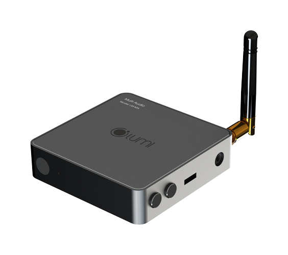
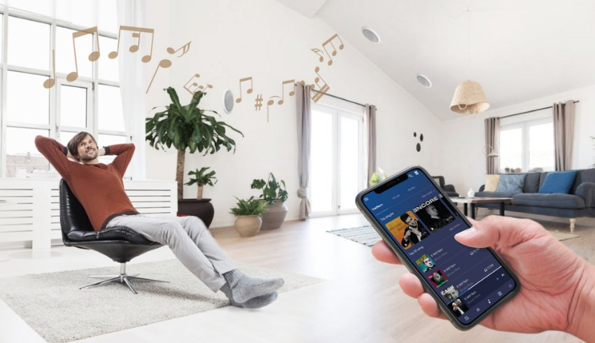

*Module âm thanh đa vùng giúp đem lại trải nghiệm về âm nhạc thú vị trong ngôi nhà của bạn. Các thiết bị có thể liên kết với nhau thành nhóm để thưởng thức âm nhạc cùng một lúc ở nhiều phòng khác nhau. Multi audio sẽ giúp **điều khiển âm thanh từ xa**, vào bất cứ lúc nào, bất cứ khi nào mà bạn muốn. Bật tắt dễ dàng mọi lúc mọi nơi.*
Sản phẩm được tích hợp với hệ thống Lumilife để bạn có thể điều khiển từ xa sử dụng trên ứng dụng Lumilife của Lumi một cách đơn giản và tiện dụng.
Đặc biệt trong phiên bản 2019 thiết bị Âm thanh đa vùng không tích hợp bộ khuếch đại âm thanh, do vậy khách hàng có thể kết hợp với các bộ âm ly ngoài thị trường có công suất cao thấp tùy nhu cầu sử dụng mà không bị giới hạn về công suất phát.
Một ngôi [**nhà thông minh**](https://lumi.vn/) sống động đầy âm nhạc luôn tạo ra một không gian thư giãn cực kỳ thoải mái.

*Module âm thanh đa vùng v2*

\>> Xem thêm sản phẩm module khác: [***Module 2 in – 2 out Zigbee***](https://lumi.vn/san-pham/module-2-in-2-out-zigbee.html)
## **1. Tính năng của module âm thanh đa vùng**
- Âm thanh đa vùng có thể chơi nhạc cho từng phòng trong căn hộ. Âm nhạc được kiểm soát bằng ứng dụng Lumilife thông qua sóng wifi.
- Hẹn giờ tắt nhạc cho thiết bị.
- Liên kết các module để thưởng thức âm nhạc cùng một lúc ở nhiều phòng khác nhau. Lưu ý: Quý khách hàng có thể nhóm nhiều thiết bị. Tuy nhiên, nhà sản xuất khuyến cáo nên để một nhóm 6 thiết bị hoặc ít hơn để đạt được độ ổn định tốt nhất.
- Nghe nhạc qua bộ nhớ điện thoại, USB hoặc trực tiếp qua mạng.

*Tính năng của module âm thanh đa vùng*

\>> Xem thêm sản phẩm khác: [***Module 2 in – 2 out Zigbee***](https://lumi.vn/san-pham/module-2-in-2-out-zigbee.html)
## **2. Cách thức hoạt động của Module âm thanh đa vùng v2**
- ***Hoạt động độc lập:*** Chỉ cần một bộ âm thanh đa vùng với âm ly đã có thể phát nhạc độc lập qua 1 số App như Muzo Player, iEAST Play hoặc giao thứ Air Play.
- ***Hoạt động thông qua bộ điều khiển trung tâm – HC:*** Bạn có thể gia nhập bộ âm thanh đa vùng vào hệ thống và chơi nhạc qua áp lumi life trên điện thoại di động. Ngoài ra, bằng điện thoại, người dùng có thể cài đặt lịch phát nhạc theo hoạt cảnh sáng/tối , even … để phù hợp với không gian ngôi nhà.
- Cách mạng công nghiệp 4.0 và mạng lưới vạn vật kết nối internet (IoT) sẽ tạo ra sự thay đổi mạnh mẽ về nguồn lực sản xuất, công nghệ thực tế ảo … IoT . Giải pháp nhà thông minh – 1 trong những ứng dụng của IoT, đã và đang trở thành xu hướng tất yếu trong đời sống.
- Hãy liên hệ ngay với chúng tôi theo số hotline **0904.665.965** để trở thành người tiếp theo sở hữu Mutil audio [**giải pháp âm thanh đa vùng**](https://lumi.vn/Am-thanh-da-vung.html) hiện đại với công nghệ thông minh và tận hưởng trọn vẹn cuộc sống tiện nghi, hiện đại của giải pháp nhà thông minh Lumi Việt Nam mang đến.

*Giải pháp âm thanh đa vùng có thể hoạt động độc lập hoặc thông qua HC*

\>> Xem thêm sản phẩm liên quan: [***Module 2 in – 2 out /BLE Mesh***](https://lumi.vn/san-pham/module-2-in-2-out-ble.html)
## **3. Lưu ý khi sử dụng Module âm thanh đa vùng Lumi V2**
Lưu ý: Thiết bị chỉ hỗ trợ USB 2.0– Ngoài ra thiết bị có hỗ trợ cổng line in 3.5 để  kết nối tới điện thoại, laptop, tivi,.. để chơi nhạc từ các nguồn phát này:

- Cắm 1 đầu dây cáp vào cổng Line-in trên thiết bị, đầu dây cáp còn lại cắm vào cổng xuất nhạc (biểu tượng tai nghe) trên thiết bị muốn kết nối. Sau đó, dùng điều khiển thiết bị nhấn nút chuyển kênh để chuyển âm thanh đa vùng sang chế độ Line-in, khi đó led thiết bị chuyển sang sáng xanh liên tục.
- **Thiết bị thông báo**: Sử dụng amply để khuếch đại tín hiệu cũng như tích hợp bộ lọc tiếng bên trong. (Lưu ý: Chúng ta phải lựa chọn amply phù hợp với công suất của loa để cho tín hiệu ra chuẩn nhất tiếng trong nhất. Không được lựa chọn amply công suất không phù hợp của loa dẫn đến cháy amply và không dùng được amply trở kháng cho các loại loa khác. Ví dụ như ta có 6 chiếc loa 10W thì chúng ta phải lựa chọn amply phù hợp công suất lớn hơn 60W hoặc bằng 60W).
- **Thiết bị âm thanh karaoke**: phục vụ đẩy công suất và lọc tiếng chuẩn hơn giúp echo dày và mượt đầu ra tín hiệu là các kênh công suất. Ví dụ đôi loa công suất là 600w ta sử dụng amply có công suất lớn hơn 600W. (Lưu ý amply này không dùng cho được các loa trở kháng.)
- **Thiết bị âm thanh sân khấu – hội trường**: Amply được sử dụng làm những cục đẩy nó chỉ nhiệm vụ đẩy công suất của loa chứ không có nhiệm vụ lọc tiếng. Thiết bị âm thanh vi tính tích hợp sẵn trong bộ điều khiển trung tâm.

\>> Tham khảo thêm sản phẩm nổi bật khác: [***Module 5 In 1 Lumi Zigbee***](https://lumi.vn/san-pham/module-5-in-1-zigbee.html)

Module âm thanh đa vùng Lumi V2 là một bước đột phá trong việc mang âm nhạc đến từng ngóc ngách của không gian. Không còn bị giới hạn bởi một hệ thống loa duy nhất, bạn có thể tận hưởng âm nhạc tại các khu vực khác nhau trong nhà, từ phòng khách đến phòng ngủ, từ sân vườn đến hồ bơi. Để nhận thông tin tư vấn chi tiết cho ngôi nhà của bạn, hãy gọi ngay hotline Lumi, nhân viên sẽ hỗ trợ bạn 24/7.
