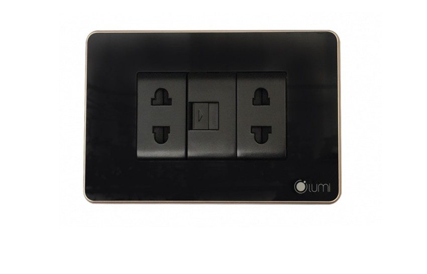

*Ổ cắm đơn 2 chấu + 1 hạt mạng không chỉ đơn thuần là một sản phẩm tiện ích, mà còn là sự kết nối hữu ích giữa việc cung cấp nguồn điện và kết nối mạng. Trong bài viết này, chúng ta sẽ cùng nhau khám phá về mẫu ổ cắm đa năng này.*
## **1. Đặc điểm của ổ cắm đơn 2 chấu + 1 hạt mạng**
Được thiết kế với kích thước phù hợp với các loại đế âm thông dụng trên thị trường, dễ dàng lắp đặt, bảo hành và thay mới, ổ cắm mạng là 1 dòng [***ổ cắm thông minh***](https://lumi.vn/danh-muc-san-pham/o-cam/) góp phần tạo nên những giải pháp tổng thể Nhà thông minh Lumi.

Ổ cắm Lumi bao gồm phần đế và hạt ổ cắm, nổi bật ở tuổi thọ cao do sử dụng những chất liệu cao cấp, cùng hệ thống linh kiện nhập khẩu từ những nhà cung cấp linh kiện uy tín thế giới như Samsung, Panasonic,…

Đối với phần đế, ổ cắm Lumi sử dụng nhựa PC với các đặc điểm: chống sốc cực tốt, chống mài mòn, chống cháy… Vì tính cách điện tốt nên nhựa PC được sử dụng nhiều trong lĩnh vực điện và điện tử, mang lại tuổi thọ cao cho thiết bị. Lõi đồng và dây đồng giúp người sử dụng yên tâm sử dụng với tốc độ dẫn điện mạnh và ổn định.

*Ổ cắm đơn 2 chấu + 1 hạt mạng*

\>> Tham khảo thêm sản phẩm: [***Động cơ rèm thông minh***](https://lumi.vn/san-pham/dong-co-rem-thong-minh.html)
## **2. Ổ cắm đảm bảo an toàn cho trẻ em**
Ổ cắm điện trong nhà thường được lắp đặt tại các vị trí thấp để phù hợp với thói quen sử dụng của các gia đình. Chính vì vậy, ổ cắm chính là nơi tiềm tàng những rủi ro về tình trạng điện giật cho trẻ em.

Để tránh tình trạng này, hạt ổ cắm Lumi được thiết kế với đồng nguyên chất chứa các linh kiện, có 2 màn che chắn phía trên 2 lỗ cắm, khi người dùng sử dụng phích cắm tác động hai lực đồng đều vào 2 lỗ cắm 2 bên, màn chập sẽ được mở ra.

Tuy nhiên, nếu con trẻ sử dụng các vật lạ cho vào ổ cắm, chỉ tác động một bên hoặc 2 bên không đồng đều, màn chập sẽ không mở ra hạn chế các rủi ro về điện giật cho trẻ em.
## **3. Thiết kế sang trọng, tinh tế, phù hợp với không gian nhà hiện đại**
Với 2 màu sắc đen và trắng, cùng mặt kính được gia cường chịu lực cao, phần viền ổ cắm được xử lý bởi công nghệ Anode, bo tròn với bề mặt mịn nhám, mang đến vẻ sang trọng, cổ điển và cao cấp.

Ổ cắm Lumi cùng với bộ sản phẩm trong giải pháp nhà thông minh giúp tôn lên vẻ sang trọng của tổ ấm gia đình hiện đại. Dù lắp đặt trên tường gạch, tường đá hay thạch cao, các ổ cắm và bộ công tắc của Lumi vẫn thể hiện sự kết hợp hài hòa về yếu tố thẩm mỹ nhà ở, thể hiện cá tính và bản sắc của chủ nhân.
## **4. Ứng dụng của ổ cắm Lumi**
Ổ cắm đơn 2 chấu + 1 hạt mạng có thể được lắt đặt ở những không gian sau:

- Phòng khách: Trong không gian phòng khách, ổ cắm này có thể được sử dụng để cung cấp nguồn điện cho các thiết bị như TV, đầu thu cáp, hay hệ thống âm thanh. Đồng thời, hạt mạng giúp duy trì kết nối internet ổn định cho các thiết bị thông minh.
- Phòng ngủ: Trong phòng ngủ, ổ cắm đơn có thể được sử dụng để cắm sạc điện thoại, máy tính xách tay hoặc đèn ngủ. Hạt mạng cũng đảm bảo bạn có kết nối internet tốt để sử dụng các thiết bị kết nối trong phòng ngủ.
- Văn phòng làm việc: Đặt trong không gian văn phòng, ổ cắm này hỗ trợ việc sạc các thiết bị điện tử như laptop, máy tính bảng và điện thoại. Hạt mạng cũng đảm bảo kết nối mạng ổn định cho công việc trực tuyến.
- Phòng học: Trong không gian học tập, ổ cắm đơn 2 chấu + 1 hạt mạng có thể hỗ trợ việc sạc laptop, sử dụng máy tính để học và duy trì kết nối mạng cho nhu cầu tìm kiếm thông tin học tập.
- Khu vực giải trí: Trong khu vực giải trí như phòng gia đình hoặc phòng chơi game, ổ cắm này có thể cung cấp nguồn điện cho các thiết bị giải trí như máy chơi game, máy chiếu, hoặc loa. Hạt mạng đảm bảo kết nối mạng ổn định để trải nghiệm giải trí tốt hơn.

Trên đây là những thông tin chi tiết về ổ cắm đơn 2 chấu + 1 hạt mạng. Để nhận tư vấn chi tiết về hệ sinh thái nhà thông minh Lumi, hãy gọi ngay hotline của công ty; đội ngũ tư vấn sẽ sẵn sàng hỗ trợ nhanh chóng và chi tiết.

**>> Xem thêm sản phẩm camera thông minh của Lumi:**

- [***Camera cảnh báo Lupa Bullet thông minh***](https://lumi.vn/san-pham/camera-canh-bao-lupa-bullet.html)
- [***Camera cảnh báo thông minh Lupa Turret***](https://lumi.vn/san-pham/camera-canh-bao-lupa-turret.html)
