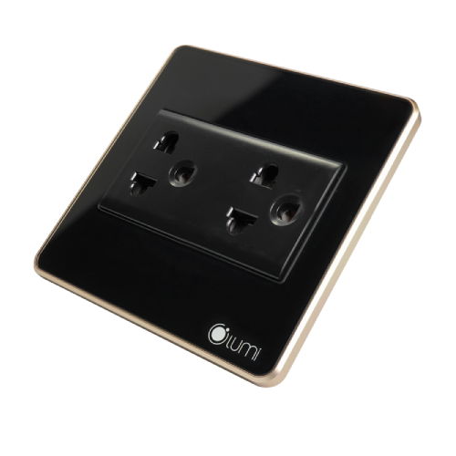

*Ổ cắm mặt kính cường lực chống xước đã mang đến một sự cải tiến đáng kể trong ngành công nghiệp thiết bị điện và điện tử. Sự kết hợp giữa chất liệu kính cường lực và tính năng chống xước không chỉ nâng cao tính thẩm mỹ, mà còn bảo vệ sản phẩm khỏi tác động của thời gian và tăng cao tính an toàn. Trong bài viết này, chúng ta sẽ cùng nhau khám phá sản phẩm ổ cắm điện thông minh cao cấp này.*
## **1. Đặc điểm của ổ cắm cường lực chống xước**
- Được thiết kế với kích thước phù hợp với các loại đế âm thông dụng trên thị trường, dễ dàng lắp đặt, bảo hành và thay mới, ổ cắm cường lực chống xước là 1 dòng sản phẩm góp phần tạo nên những giải pháp tổng thể Nhà thông minh Lumi.
- Ổ cắm Lumi bao gồm phần đế và hạt ổ cắm, nổi bật ở tuổi thọ cao do sử dụng những chất liệu cao cấp, cùng hệ thống linh kiện nhập khẩu từ những nhà cung cấp linh kiện uy tín thế giới như Samsung, Panasonic,…
- Đối với phần đế, ổ cắm Lumi sử dụng nhựa PC với các đặc điểm: chống sốc cực tốt, chống mài mòn, chống cháy… Vì tính cách điện tốt nên nhựa PC được sử dụng nhiều trong lĩnh vực điện và điện tử, mang lại tuổi thọ cao cho thiết bị. Lõi đồng và dây đồng giúp người sử dụng yên tâm sử dụng với tốc độ dẫn điện mạnh và ổn định.

*Ổ cắm mặt kính cường lực chống xước*
## **2. Ổ cắm điện thông minh an toàn cho trẻ em**
- Ổ cắm điện trong nhà thường được lắp đặt tại các vị trí thấp để phù hợp với thói quen sử dụng của các gia đình. Chính vì vậy, ổ cắm chính là nơi tiềm tàng những rủi ro về tình trạng điện giật cho trẻ em.
- Để tránh tình trạng này, hạt ổ cắm Lumi được thiết kế với đồng nguyên chất chứa các linh kiện, có 2 màn che chắn phía trên 2 lỗ cắm, khi người dùng sử dụng phích cắm tác động hai lực đồng đều vào 2 lỗ cắm 2 bên, màn chập sẽ được mở ra.
- Tuy nhiên, nếu con trẻ sử dụng các vật lạ cho vào ổ cắm, chỉ tác động một bên hoặc 2 bên không đồng đều, màn chập sẽ không mở ra hạn chế các rủi ro về điện giật cho trẻ em.
## **3. Thiết kế sang trọng, tinh tế, phù hợp với không gian nhà hiện đại**
- Với 2 màu sắc đen và trắng, cùng mặt kính được gia cường chịu lực cao, phần viền ổ cắm được xử lý bởi công nghệ Anode, bo tròn với bề mặt mịn nhám, mang đến vẻ sang trọng, cổ điển và cao cấp.
- Ổ cắm Lumi cùng với bộ sản phẩm trong giải pháp nhà thông minh giúp tôn lên vẻ sang trọng của tổ ấm gia đình hiện đại. Dù lắp đặt trên tường gạch, tường đá hay thạch cao, các ổ cắm và bộ công tắc của Lumi vẫn thể hiện sự kết hợp hài hòa về yếu tố thẩm mỹ nhà ở, thể hiện cá tính và bản sắc của chủ nhân.
- Kết hợp giữa tính năng vượt trội và thiết kế tinh tế, ổ cắm mặt kính cường lực chống xước không chỉ là sự lựa chọn tối ưu cho không gian sống hiện đại, mà còn mang đến giá trị thẩm mỹ và chất lượng cho ngôi nhà của bạn. Để nhận thông tin tư vấn chi tiết cho ngôi nhà của bạn, hãy liên hệ ngay hotline, đội ngũ tư vấn sẽ sẵn sàng hỗ trợ nhanh chóng mọi lúc mọi nơi.

**>> Tham khảo thêm một số thiết bị nhà thông minh Lumi khác:**

- [***Ổ cắm đơn 2 chấu + 1 hạt mạng***](https://lumi.vn/san-pham/o-cam-don-2-chau-1-hat-mang.html)
- [***Động cơ rèm tự động***](https://lumi.vn/san-pham/dong-co-rem-thong-minh.html)
- [***Camera cảnh báo thông minh Lupa Bullet***](https://lumi.vn/san-pham/camera-canh-bao-lupa-bullet.html)
