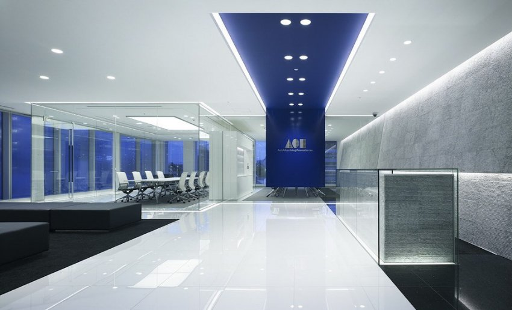
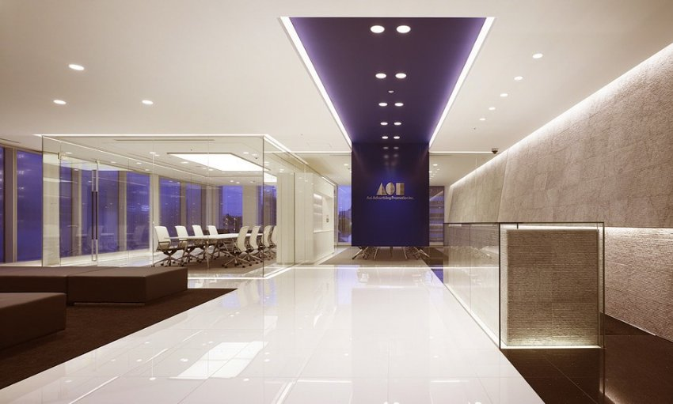
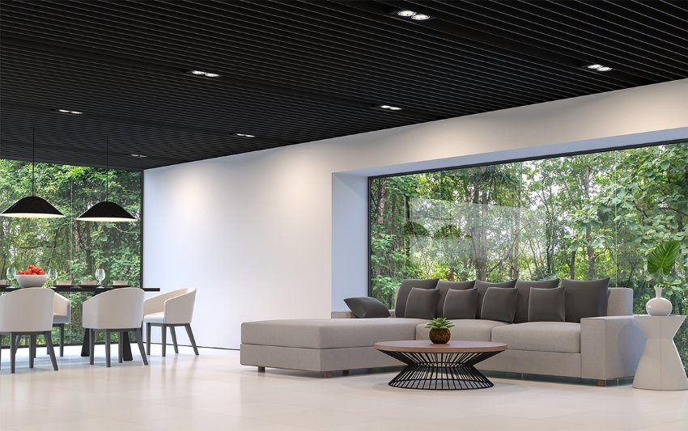

*Đèn LED downlight thông minh âm trần đi kèm với các tính năng điều khiển ánh sáng thông minh, cho phép bạn tạo ra không gian sáng đẹp và ấm cúng. Bạn có thể điều chỉnh độ sáng và màu sắc của đèn theo ý thích của mình, tạo ra các không gian sáng tạo và tinh tế. Để hiểu rõ các tính năng của mẫu đèn này, hãy tham khảo các thông tin trong bài viết dưới đây.*
## **1. Đặc điểm đèn LED Downlight thông minh âm trần Lumi**
- Đèn downlight là một thiết bị chiếu sáng đa năng tuyệt vời cho nhiều mục đích sử dụng. Bạn có thể bật/ tắt, hẹn giờ, thay đổi nhiệt độ màu và độ sáng của đèn Downlight thông minh Lumi bằng Smartphone và giọng nói. 
- Thường được lắp chìm vào bên trong trần nhà, đèn Downlight phát ra chùm sáng hẹp, giúp cải thiện chất lượng ánh sáng hiệu quả ở mọi không gian. Không chỉ làm tốt các nhiệm vụ chiếu sáng cơ bản, ánh sáng từ đèn Downlight còn giúp bạn kiến tạo những không gian sang trọng, tinh tế, mang dấu ấn phong cách cá nhân.
- Ngoài ra, đèn Downlight với một số mẫu mã chuyên biệt còn có thể giúp bạn khơi gợi cảm xúc cho những tác phẩm hội họa hay những đồ đạc mang tính nghệ thuật như tranh vẽ, nhạc cụ…

*Đèn LED Downlight thông minh âm trần Lumi lắp đặt tại văn phòng*

\>> Xem thêm mẫu sản phẩm: [***Đèn LED Panel thông minh 600x600mm***](https://lumi.vn/san-pham/den-led-panel-thong-minh-600x600mm.html)
## **2. Ứng dụng của đèn downlight âm trần thông minh**
- Các loại đèn LED Downlight âm trần với công suất <10W sẽ phù hợp để chiếu sáng cho các không gian nội thất gia đình như phòng khách, phòng ngủ, phòng bếp…
- Còn đối với các địa điểm có không gian lớn hơn như nhà hàng, khách sạn, trung tâm mua sắm, siêu thị, trường học, văn phòng…, nên dùng đèn âm trần thông minh downlight có công suất từ 10W trở lên sẽ phù hợp hơn.
- Đặc biệt, chỉ bằng một chạm trên Smartphone, bạn có thể dễ dàng bật/ tắt/ hẹn giờ chiếu sáng toàn bộ hệ thống chiếu sáng, hoặc một số vùng không gian nhất định.

*Ứng dụng LED Downlight cho không gian ấm cúng*

\>> Xem thêm sản phẩm đèn trang trí cao cấp Lumi: [***Đèn LED dây RGB 16 triệu màu***](https://lumi.vn/san-pham/den-led-day-thong-minh-rgb-16-trieu-mau.html)

- Bên cạnh thỏa mãn nhu cầu chiếu sáng cơ bản, đèn downlight âm trần thông minh còn là một nguồn cảm hứng cho những sáng tạo vô tận của các kiến trúc sư và nhà thiết kế nội thất; trong việc sử dụng ánh sáng để thổi hồn vào những góc không gian mang tính nghệ thuật và dấu ấn của chủ nhà.

*LED Downlight thông minh ứng dụng trong gia đình*

- Đặc biệt, bên cạnh khả năng chiếu sáng, đèn Downlight thông minh Lumi với ứng dụng công nghệ chiếu sáng lấy con người làm trung tâm HCL.
- Bên cạnh đó đèn còn cho phép chủ nhà tùy chỉnh nhiệt độ màu và cường độ ánh sáng, tạo ra ánh sáng mô phỏng ánh sáng của mặt trời trong tự nhiên, bảo vệ nhịp sinh học của con người trong môi trường sống hiện đại.
- Tất cả những tùy chọn để điều chỉnh đèn LED âm trần đều có thể được thực hiện thông qua Smartphone và giọng nói, mang lại sự tiện lợi cho chủ nhà.

\>> Tham khảo thêm mẫu đèn LED dây phổ biến: [***Đèn LED dây Tunable White WW thông minh***](https://lumi.vn/san-pham/den-led-day-thong-minh-tunable-white.html)
## **3. Ưu điểm của đèn Downlight âm trần thông minh Lumi**
- Cho phép bật/ tắt/ hẹn giờ đèn bằng Smartphone và giọng nói
- Sử dụng kết nối không dây Bluetooth Mesh, giúp chủ nhà dễ dàng điều khiển đèn hoặc các cụm đèn mà không bị ảnh hưởng bởi hạ tầng điện
- Ứng dụng công nghệ chiếu sáng lấy con người làm trung tâm (Human Centric Lighting – HCL) giúp cải thiện nhịp sinh học 
- Tuổi thọ đèn kéo dài đến 25000 giờ chiếu sáng, tương đương với hơn 10 năm (trung bình chiếu sáng 6h/ ngày)
- Ánh sáng trung thực với mắt người với độ hoàn màu CRI = 90
- Dễ dàng kết hợp cùng các thiết bị thông minh Lumi khác để tạo ra các kịch bản sống tiện ích cho [***ngôi nhà thông minh***](https://lumi.vn/).

Với công nghệ LED tiên tiến, đèn Downlight âm trần thông minh tiêu thụ ít năng lượng hơn so với đèn truyền thống, giúp giảm thiểu hóa đơn tiền điện hàng tháng của bạn. Hãy trải nghiệm ngay tiện ích của sản phẩm này bằng cách liên hệ hotline hoặc để lại thông tin để nhận được tin vấn chi tiết nhất từ đội ngũ chuyên viên.
