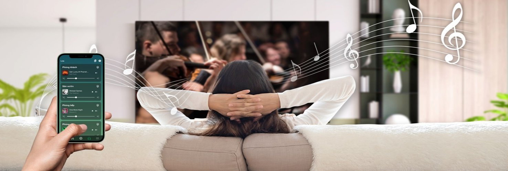
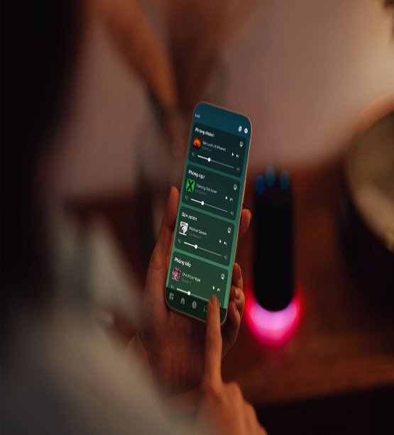
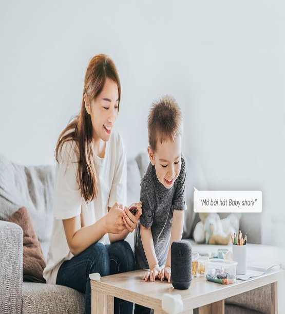
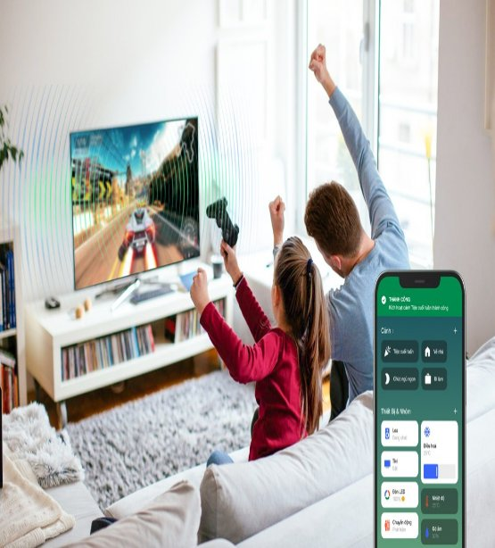
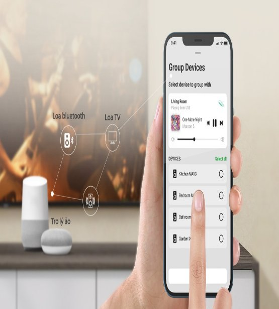
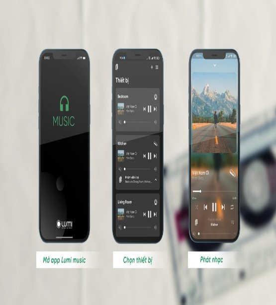

# **Âm thanh đa vùng**
Nghe nhạc chất lượng cao ở bất cứ đâu trong ngôi nhà của mình, từ phòng khách cho tới ban công, từ tầng 1 cho tới tầng 3. Tất cả những điều bạn cần làm là sử dụng giọng nói hoặc smartphone

# **Điều khiển từ xa qua smartphone**
Đóng vai trò như người “trợ lý âm thanh” cho chủ nhân ngôi nhà, giải pháp âm thanh đa vùng giúp bạn có những phút giây thư giãn với âm nhạc:
– Chạm nhẹ trên Smartphone để kích hoạt chơi nhạc tại tất cả các phòng
– Tùy chọn bài hát từ Playlist trên điện thoại

## **Ra lệnh phát nhạc bằng giọng nói**
Hệ sinh thái nhà thông minh Lumi đã tích hợp thành công các trợ lý ảo có thể nghe – hiểu câu lệnh, giúp gia tăng trải nghiệm sống của người dùng. Chủ nhà có thể khám phá quyền năng của giọng nói bằng cách ra lệnh cho Google Assistant, Alexa hoặc Siri của Apple phát nhạc tại một khu vực cụ thể trong nhà và tận hưởng tiện ích tuyệt vời này

## **Tích hợp vào các kịch bản sống tiện ích**
Hệ thống âm thanh đa vùng có thể kết nối với thiết bị khác trong nhà thông minh để tạo nên những kịch bản sống đa dạng. Đặc biệt, việc kết hợp âm thanh đa vùng với hệ thống đèn LED 16 triệu màu có thể tạo nên một không gian bữa tiệc “hòa âm ánh sáng”, phù hợp cho những buổi tiệc tùng, sinh nhật

## **Kết nối đa dạng với TV và các hệ thống loa**
Module âm thanh đa vùng của Lumi luôn sẵn sàng kết nối với hầu hết các hệ thống loa và không yêu cầu cao về hệ điều hành của nền tảng thiết bị. Từ TV thông minh, loa cầm tay đến những hệ thống loa thanh trong phòng đều có thể trở thành mạng lưới âm thanh đồng bộ và dễ dàng điều khiển.

## **3 giây mở nhạc từ app Lumi Music, Lumi Life+**
Bên cạnh ứng dụng Lumi Life+ quen thuộc, âm thanh đa vùng Lumi được bổ sung ứng dụng riêng – Lumi Music với giao diện đơn giản, trực quan, cho phép người dùng lựa chọn, mở hoặc hẹn giờ phát bài hát yêu thích cho toàn bộ không gian sống từ smartphone, chỉ trong vòng 3 giây.

