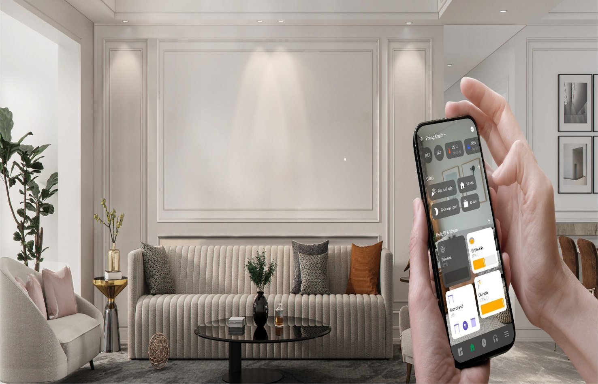
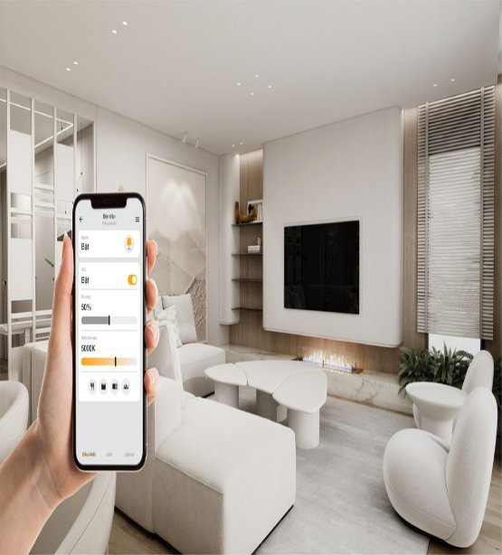
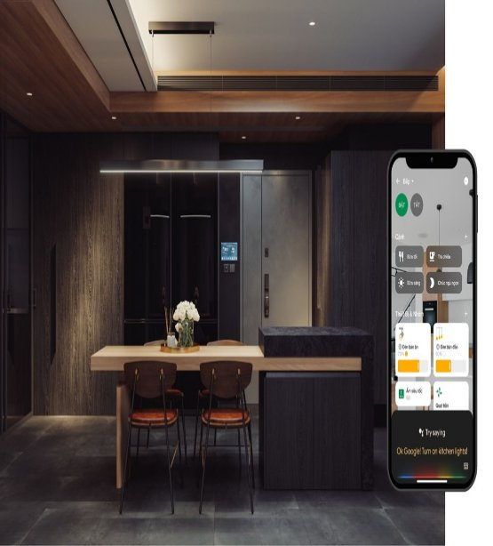
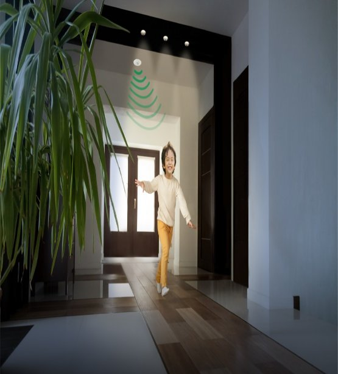
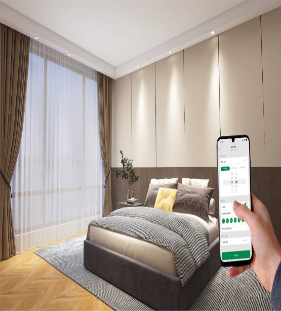

# **Chiếu sáng thông minh**
Giải pháp chiếu sáng thông minh của [**Lumi**](https://lumi.vn/) cho phép điều khiển, bật/ tắt, hẹn giờ, cài đặt ngữ cảnh với hệ thống đèn chiếu sáng trong nhà thông minh qua Smartphone hoặc giọng nói. Khi thiết kế đèn thông minh, hệ thống đèn thông minh không yêu cầu lắp đặt bóng đèn thông minh, giúp bạn tiết kiệm chi phí lắp đặt và bảo dưỡng.

# **Điều khiển từ xa qua smartphone**
Không cần bật/ tắt trực tiếp tại công tắc, bạn có thể dễ dàng điều khiển hệ thống chiếu sáng trong nhà từ xa trong nhà từ bất kỳ đâu thông qua Smartphone:
– Từ trong phòng ngủ bật đèn phòng bếp, phòng khách, ngoài sân, hành lang, sân thượng,..
– Khi đi công tác, du lịch nước ngoài vẫn có thể theo dõi, điều chỉnh đèn điện trong nhà

## **Điều khiển bằng giọng nói**
Dễ dàng bật/tắt đèn bằng giọng nói mà không cần phải mở ứng dụng Lumi Life trên điện thoại. Hiện nay Lumi đã tích hợp thành công 2 trợ lý ảo Google Assistant và Alexa vào hệ sinh thái. Nếu muốn bật/ tắt đèn, bạn chỉ cần ra lệnh cho các trợ lý ảo:
“Ok Google! Turn on corridor light”
“Alexa! Turn on kitchen light”

## **Tự động bật đèn khi phát hiện chuyển động**
Tự động bật đèn khi có chuyển động cảm biến chuyển động gắn trần/ tường, công tắc cầu thang tích hợp cảm biến tại các khu vực như nhà tắm, cầu thang… sẽ điều khiển đèn bật sáng khi có chuyển động trong vùng cảm ứng và ngược lại, đảm bảo an toàn cho người già, trẻ nhỏ khi di chuyển vào buổi tối

## **Hẹn giờ chiếu sáng**
Chức năng hẹn giờ chiếu sáng đem lại sự tiện ích cho chủ nhà tại những khu vực chiếu sáng có thời gian bật/ tắt thường xuyên và cố định trong ngày:
– Cài đặt đèn trang trí vườn tự động bật lúc 17h00 và tắt lúc 5h00 sáng
– Biển hiệu quảng cáo tự động tắt đèn sau 23h00

## **Tích hợp các kịch bản sống tiện ích**
Các thiết bị đèn chiếu sáng trong nhà có thể kết nối với nhau và kết nối với các thiết bị điện khác, giúp bạn dễ dàng cài đặt các ngữ cảnh như:

– “Đi ngủ” – Tự động tắt hết đèn sáng, chỉ bật đèn ngủ
– “Tiếp khách” – Bật toàn bộ hệ thống đèn phòng khách như đèn chùm, downlight, đèn tranh…
– “Đi làm” – Toàn bộ đèn trong nhà sẽ tắt

