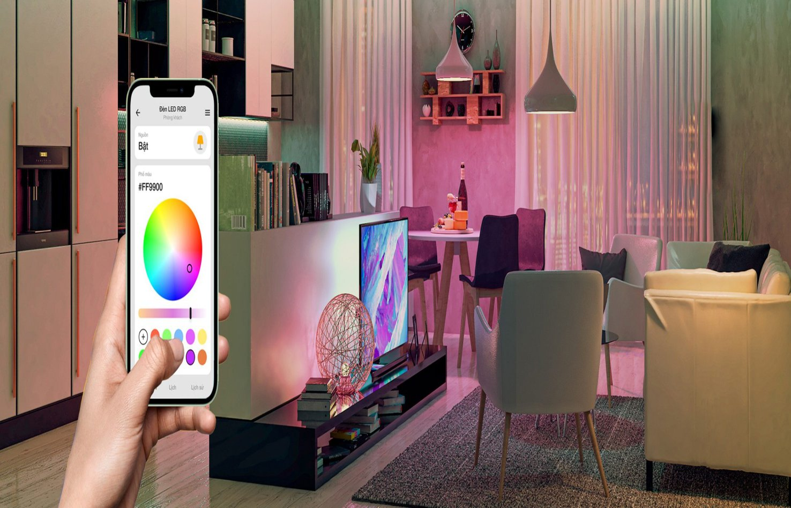
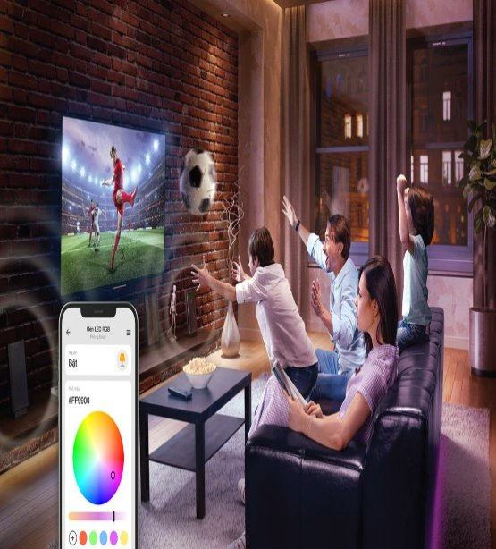
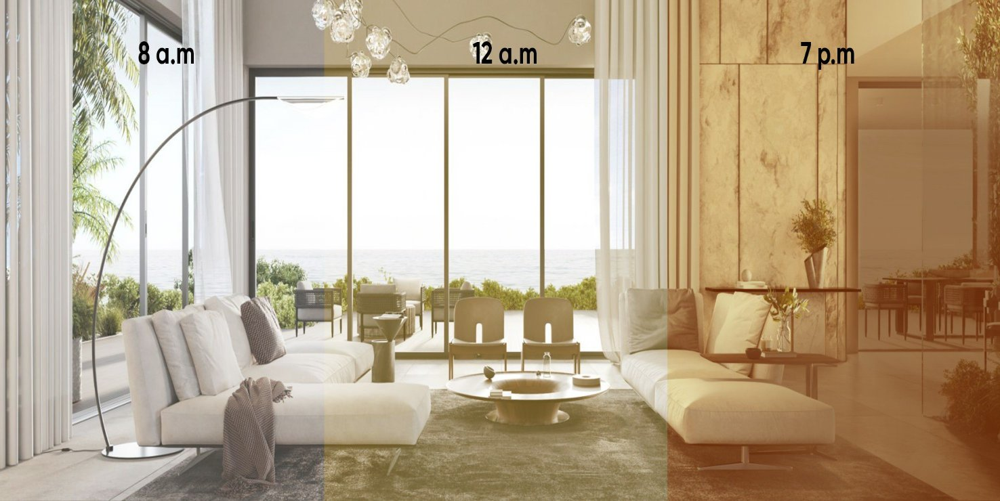
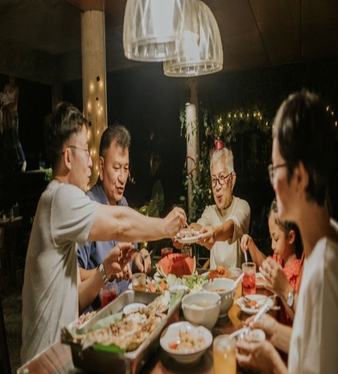



# **Đèn LED thông minh 16 triệu màu**
Giải pháp điều khiển đèn LED thông minh Lumi giúp bạn thay đổi đổi màu sắc không gian, điều chỉnh độ sáng, sao cho phù hợp với ngữ cảnh như sinh nhật, Giáng Sinh, Tết, hay ăn tối

# **Kiến tạo không gian đa màu sắc qua smartphone**
Ý tưởng về một bữa tiệc sinh nhật ý nghĩa, nhiều cảm xúc sẽ trở thành hiện thực với đèn hệ thống LED 16 triệu màu, cho phép biến đổi màu sắc linh hoạt thông qua Smartphone

## **Thay đổi màu sắc theo giờ**

## **Tích hợp vào các kịch bản sống tiện ích khác**
Một bữa tiệc sẽ không trọn vẹn nếu chỉ có ánh sáng rực rỡ. Bạn hoàn toàn có thể biến bữa tiệc trở nên sôi động hơn với hệ thống âm thanh với những bản nhạc “chất lừ”, khơi dậy sự tham gia hào hứng của khách mời. Một bữa tiệc hòa âm – ánh sáng sẽ diễn ra ngay tại nhà bạn và theo kịch bản của chính bạn
