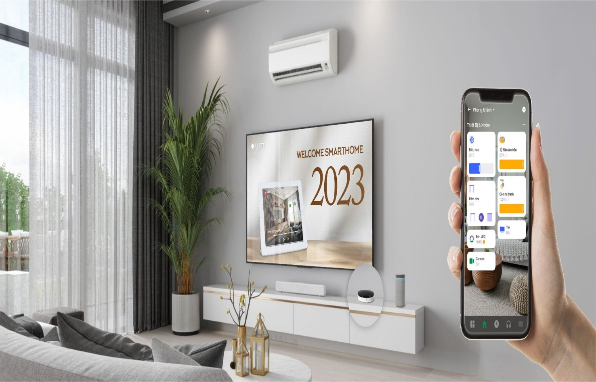
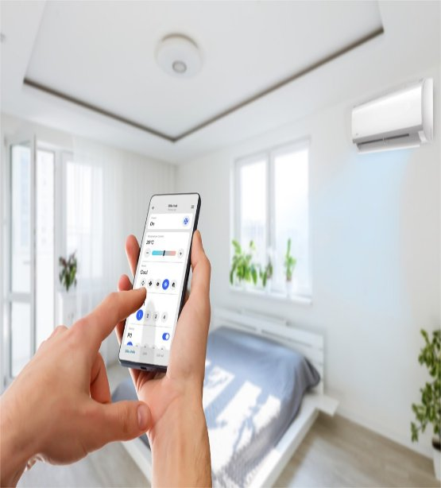
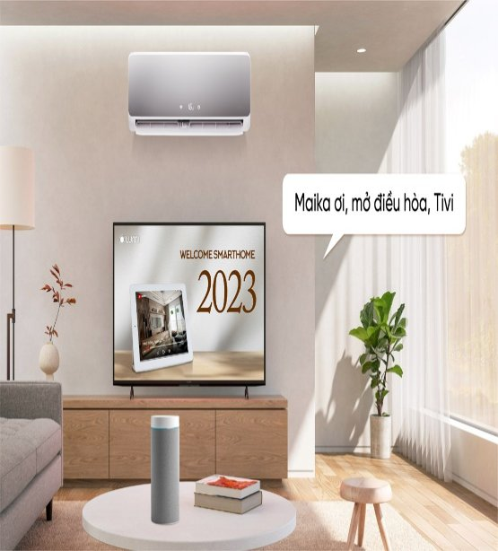
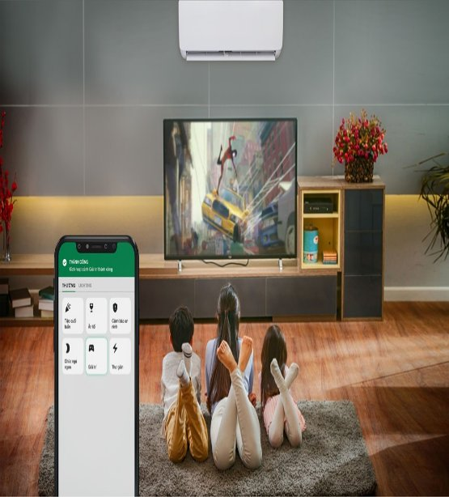



# **Điều khiển TV, điều hòa, quạt thông minh**
Với giải pháp thông minh cho điều hòa, tivi, những chiếc điều khiển đều trở nên vô nghĩa. Tất cả những gì bạn cần là một chiếc Smartphone để điều khiển các thiết bị trên.

# **Điều khiển điều hòa, ti vi, quạt điện bằng smartphone**
Công nghệ kết nối không dây Zigbee cùng bộ điều khiển hồng ngoại cho phép điều khiển bật/ tắt tivi, điều hòa thông minh và điều chỉnh cho phù hợp với nhu cầu người dùng. Bộ điều khiển hồng ngoại đọc được gần 400 lệnh từ các hãng Tivi và điều hòa thông dụng cho phép tích hợp nhanh chóng các thiết bị có sẵn trong nhà mà không cần mua mới

## **Bật tắt điều hòa, ti vi bằng giọng nói**
Chủ nhà có thể trải nghiệm sự quyền năng của giọng nói thông qua các trợ lý ảo như Google Assistant, Siri, Alexa. Người dùng có thể dễ dàng bật tắt tivi bằng Google assistant, Siri với câu lệnh:
“OK Google! Turn on television”
“Hey Siri! Turn on air-conditioner”

## **Tích hợp vào các kịch bản sống tiện ích**
Trên app Lumi Life của chủ nhà thông minh Lumi sẽ thường xuyên cập nhật các thông số về thời tiết như nhiệt độ, ánh sáng, độ ẩm. Chủ nhà có thể cài đặt theo kịch bản sau để tối ưu các trải nghiệm tiện ích với nhà thông minh Lumi:
– Nếu độ ẩm không khí >80%, điều hòa thông minh sẽ tự động bật để khử ẩm, giữ cho

