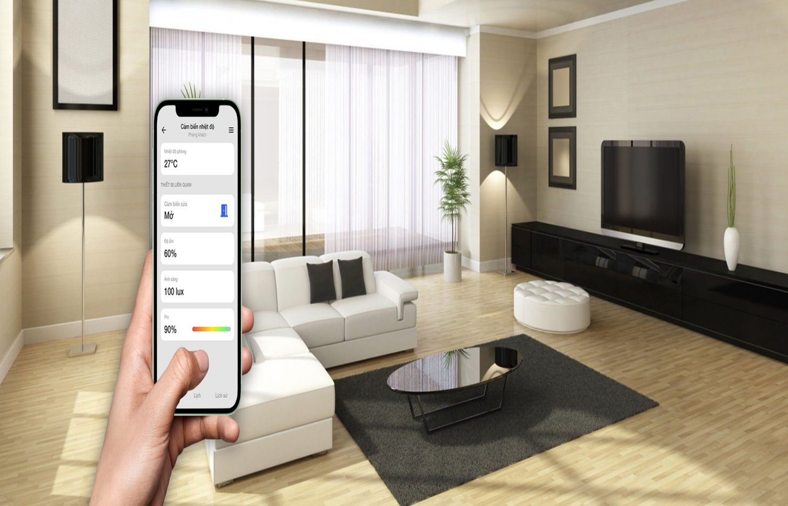
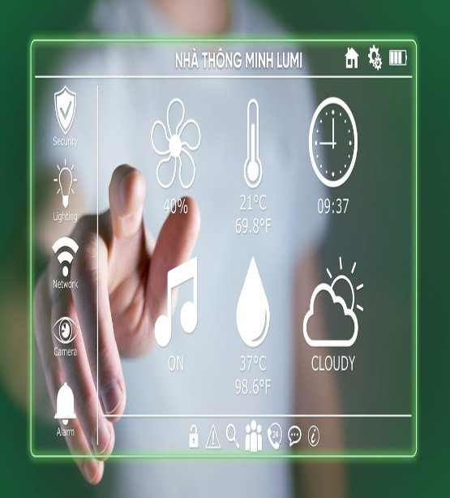
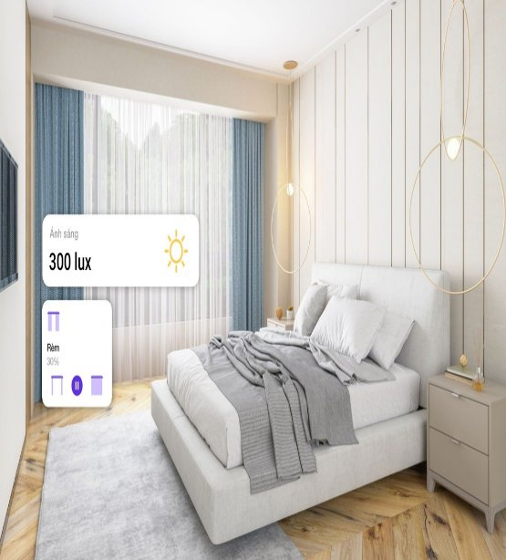



# **Giám sát điều kiện môi trường**

Giám sát điều kiện môi trường xung quanh nhà bạn, dễ dàng kiểm tra nhiệt độ, độ ẩm bên trong nhà bếp, nhà kho, vườn, từ đó đưa ra hành động thích hợp như mở điều hòa, mở quạt, tưới cây

# **Liên tục cập nhật thông số về môi trường**
Thiết bị đo thông số môi trường tích hợp trong bộ sản phẩm nhà thông minh Lumi sẽ giúp bạn luôn nắm được tình trạng nhiệt độ, độ ẩm, ánh sáng tại bất cứ căn phòng nào nhà vì chúng sẽ được cập nhật trên app Lumi Life của bạn

## **Chăm sóc sức khỏe cho cả nhà**
Việc kiểm soát được các thông tin môi trường sẽ giúp bạn dễ dàng chăm sóc gia đình hơn. Ví dụ, nếu thấy nhiệt độ trong phòng ngủ của con nhỏ quá lạnh, bố mẹ có thể tăng nhiệt độ điều hòa để bảo vệ sức khỏe của con

## **Tích hợp trong các kịch bản tiện ích khác**
Biết được các thông tin môi trường sẽ là điều kiện đầu vào để thiết lập một số kịch bản sống bảo vệ sức khỏe cả nhà. Ví dụ, bạn có thể cài đặt cho rèm cửa mở ra, đèn sáng bật lên khi thông số ánh sáng báo hiệu trời đã chuyển sang tối, đóng rèm cửa khi ánh nắng bắt đầu chói chang

