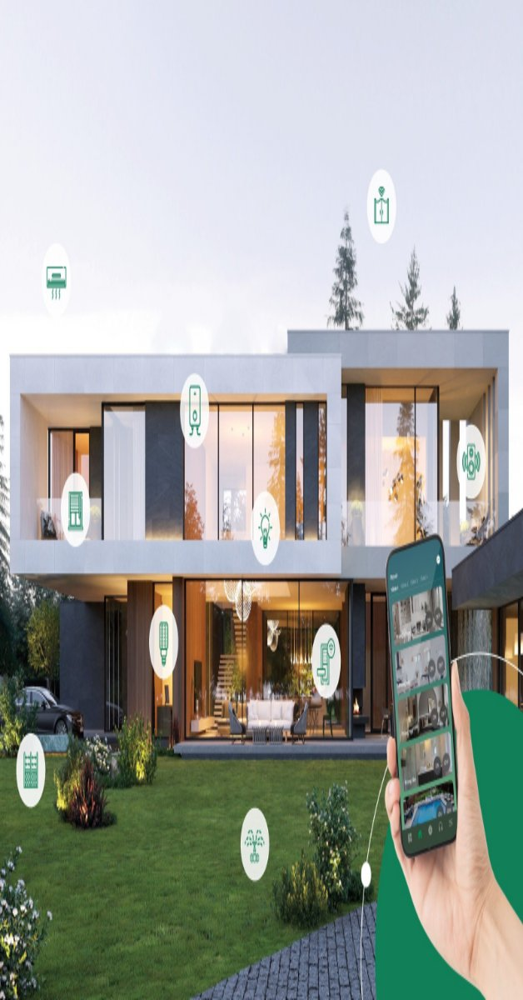
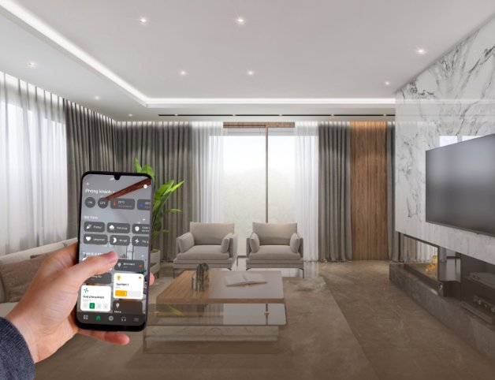
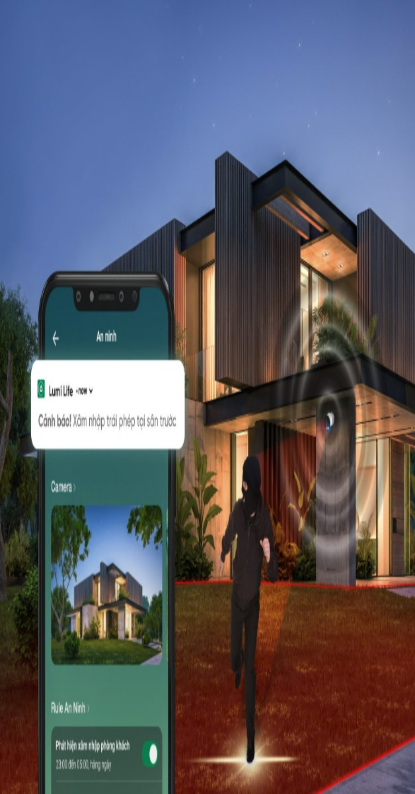

## **Nhà thông minh (Smart Home) là gì?**
Nhà thông minh (Smart Home/ Smart House) là ngôi nhà được trang bị hệ thống thiết bị cho phép chủ nhân có thể hẹn giờ hoạt động, điều khiển bật/tắt các thiết bị nhà thông minh như hệ thống điều khiển đèn chiếu sáng, rèm cửa, cổng tự động điều hòa nhiệt độ, tivi, âm thanh, khóa cửa, bình nóng lạnh, quạt thông gió, camera an ninh, hệ thống bơm tưới nước tiểu cảnh, bể cá,...để có thể điều khiển chúng thông qua các thiết bị gắn trên tường hoặc dùng Smartphone, máy tính bảng.

## **Tiện nghi tuyệt đối**

Với chiếc Smartphone được kết nối Internet trong tay, bạn có thể điều khiển tất cả các thiết bị điện trong nhà hoạt động theo ý muốn hoặc các kịch bản mà bạn đã thiết lập sẳn, để điều khiển các thiết bị nhà thông minh hoạt động.

`   `Một kịch bản thường gặp: Trước khi trở về nhà từ cơ quan, bạn chỉ cần mở chiếc Smartphone của mình và chạm nhẹ kịch bản “VỀ NHÀ” thì bình nóng lạnh sẽ được bật, hệ thống quạt thông gió, điều hòa nhiệt độ sẽ hoạt động…để khi bạn về đến nhà, tất cả đã sẵn sàng phục vụ. Với các giải pháp nhà thông minh, bạn có thể theo dõi và điều khiển cả căn nhà từ xa dù ở bất kỳ đâu bằng Smartphone có Internet. Hệ thống nhà thông minh - smart home luôn mang đến tiện nghi tuyệt đối cho mỗi gia đình.

## **An ninh toàn diện - Tiết kiệm tối đa**
Hệ thống an ninh trong ngôi nhà nắm giữ vai trò quan trọng, bảo vệ ngôi nhà 24/7, kiểm soát khi bị xâm nhập trái phép. Bật đèn tại khu vực có đột nhập, báo động qua còi hú trong nhà, gửi tin nhắn hoặc gọi điện đến các số điện thoại của các thành viên trong gia đình hoặc các số điện thoại khẩn cấp khác mà bạn đã đăng ký. Hệ thống an ninh sẽ hỗ trợ bạn kích hoạt tự động đi cùng với các kịch bản khác trong ngôi nhà, giúp bạn hoàn toàn yên tâm khi ở nhà cũng như khi vắng nhà. 

Hệ thống Smarthome tiết kiệm được tối đa lượng điện nó giúp gia chủ loại bỏ nỗi lo quên tắt thiết bị điện, giảm thời gian chờ đợi các thiết bị trong nhà hoạt động và giảm công sức đi lại tương tác với công tắc cơ.

