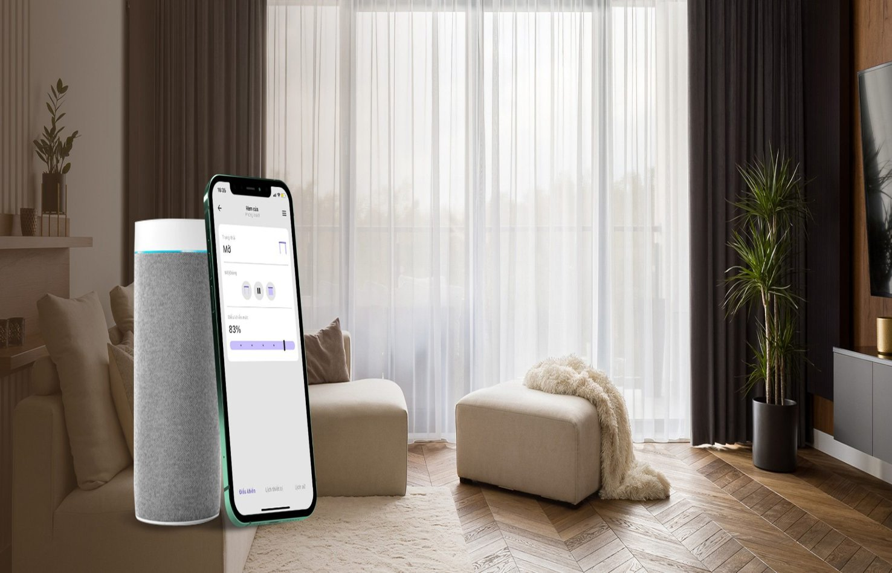
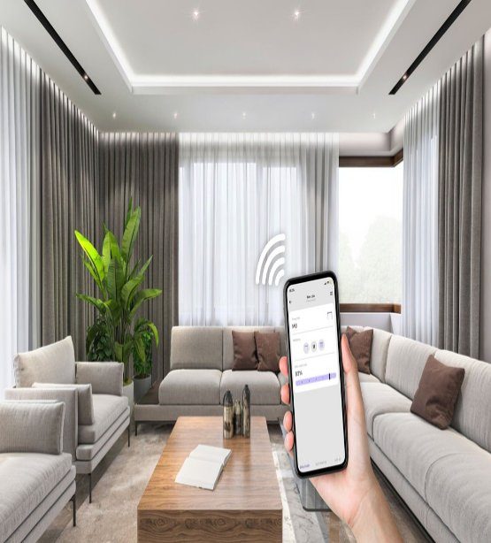
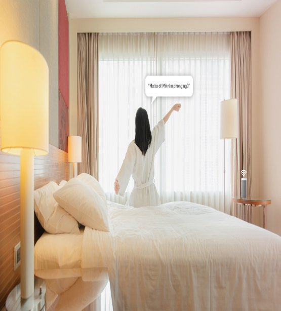
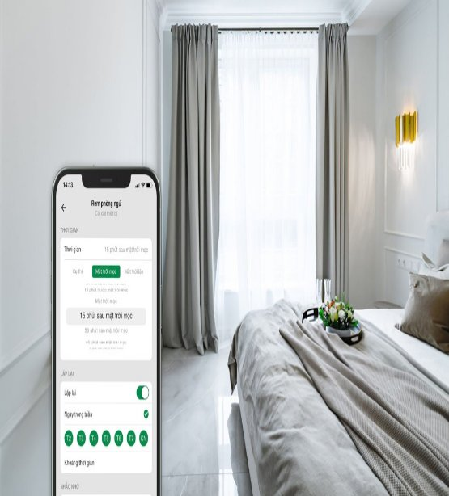
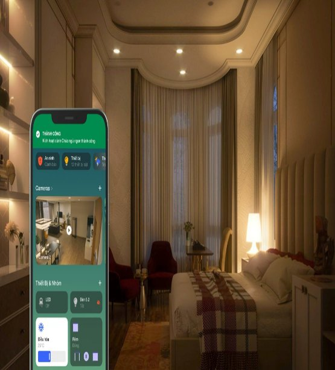



# **Điều khiển rèm cửa thông minh**
Giải pháp rèm cửa tự động cho phép cài đặt rèm tự động mở đón bình minh mỗi buổi sáng và đóng lại khi đêm về thông qua Smartphone hoặc giọng nói. Người dùng cũng có thể điều khiển rèm thông minh thông qua smartphone một cách dễ dàng.

# **Đóng/mở rèm thông minh bằng smartphone**
Hệ thống rèm cửa thông minh được kết nối vào hệ sinh thái Nhà thông minh Lumi, lắp đặt rèm thông minh cho phép bạn điều khiển một cách tiện lợi:
– Đóng/ mở bộ rèm cửa thông minh cao cấp chỉ bằng những động tác chạm – nhả trên điện thoại thông minh.
– Ở tầng 1 vẫn có thể mở cửa rèm tầng 2, tầng 3 qua smartphone hoặc có thể cài đặt kịch bản để rèm tự động đóng/mở
– Đi du lịch, công tác nước ngoài vẫn có thể kiểm tra trạng thái toàn bộ rèm ở nhà thông qua điều khiển rèm cửa sổ/màn cửa/vách ngăn thông minh bằng điện thoại.

## **Điều khiển trạng thái rèm bằng giọng nói**
Với việc mở cổng kết nối thành công các sản phẩm của nhà thông minh Lumi với Google Assistant, Alexa và Siri, giờ đây người dùng có thể sử dụng giọng nói của mình để điều khiển rèm cửa theo ý muốn. Mỗi buổi tối trước khi đi ngủ, bạn chỉ cần nói “Alexa! Close all curtains” là tất cả rèm cửa trong nhà sẽ được đóng lại, hạn chế tình trạng quên đóng rèm do sơ suất

## **Hẹn giờ đóng/ mở rèm tự động**
Ngoài việc dùng Smartphone hay giọng nói để điều khiển bộ rèm cửa thông minh, chủ nhà còn có thể cài đặt thời gian đóng/mở rèm cửa vào những thời gian nhất định trong ngày nhờ tạo sẵn kịch bản ngay khi lắp rèm tự động:
– 6h30 sáng, toàn bộ rèm cửa tự động đều được mở đánh thức cả nhà
– 22h30 đêm, tất cả rèm tự động đóng lại nhắc nhở chủ nhân đã đến giờ đi ngủ

## **Tích hợp vào các kịch bản sống tiện ích**
Với việc lắp đặt rèm cửa tự động cùng các giải pháp thông minh khác, chủ nhà có thể tạo ra nhiều kịch bản khác nhau khiến nhiều thiết bị thông minh cùng hoạt động 1 lúc, tạo ra không gian phù hợp cho từng nhịp sống.

– Khi lắp rèm tự động có thể kích hoạt kịch bản “Đi ngủ”: toàn bộ rèm cửa sẽ tự động đóng lại, đèn phòng sẽ giảm dần độ sáng đến lúc tắt hẳn, hệ thống âm thanh phát những bản nhạc nhẹ nhàng đưa chủ nhà đi vào giấc ngủ.
